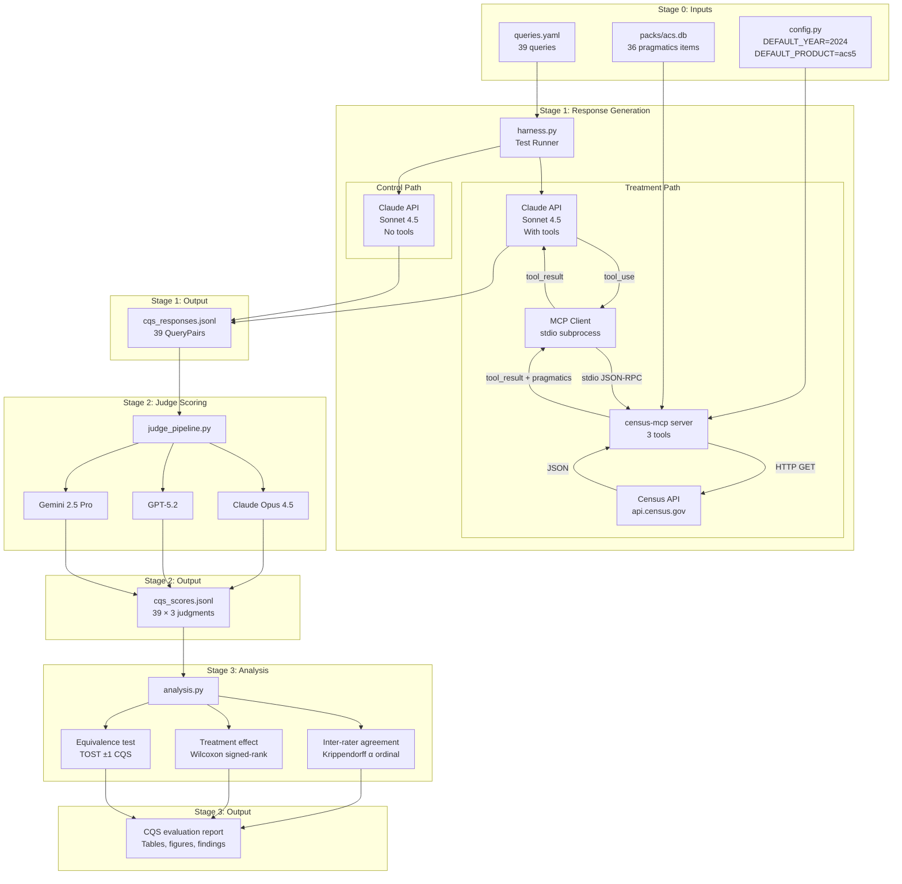

# CQS Evaluation Test Plan

**Version:** 1.0
**Date:** 2026-02-12
**Author:** Brock Webb
**Status:** Stage 1 approved for execution; Stages 2-3 stubbed pending Stage 1 results

---

## 1. Purpose & Scope

This test plan specifies the complete experimental protocol for evaluating whether a pragmatics layer improves AI-mediated Census data consultation quality.

**Research question:** Does grounding an LLM with structured statistical methodology guidance (via MCP tools) produce measurably better Census data consultation than the same LLM operating from training data alone?

**Scope:** ACS data consultation via the Census MCP Server. Single-turn, zero-shot queries. One test subject model (Claude Sonnet 4.5). Three-model judge panel. CQS rubric scoring.

**Out of scope (v0.1):** Multi-turn consultation, non-Anthropic test subjects, decennial/CPS data products, real-time geographic resolution.

### 1.1 Reference Documents

| Document | Location | Content |
|---|---|---|
| CQS Rubric Specification | `docs/verification/cqs_rubric_specification.md` | Six scoring dimensions, framework crosswalk |
| Judge Prompt Template | `docs/verification/cqs_judge_prompt_template.md` | Judge instructions, Pydantic output schema |
| Test Battery | `docs/verification/cqs_test_battery.md` | 39 queries with expected behaviors |
| Harness Architecture | `docs/verification/cqs_harness_architecture.md` | Module specs, reproducibility contract |
| Decision Log | `docs/verification/phase4b_decision_log.md` | 19 design decisions with rationale |
| Code Provenance | `docs/verification/code_provenance_log.md` | Reuse map from harmonization project |
| SRS | `docs/requirements/srs.md` | Requirements QR-010–016, C-006, VR-010 |

---

## 2. Test System Architecture

### 2.1 System Diagram



### 2.2 Component Inventory

| Component | File | Status | Description |
|---|---|---|---|
| Test battery | `src/eval/battery/queries.yaml` | ✅ Built | 39 queries, machine-readable |
| Server config | `src/census_mcp/config.py` | ✅ Built | Externalized defaults, env overrides |
| Pydantic models | `src/eval/models.py` | ✅ Built | ToolCall, ResponseRecord, QueryPair |
| MCP client | `src/eval/mcp_client.py` | ✅ Built | Subprocess lifecycle, tool dispatch |
| Agent loop | `src/eval/agent_loop.py` | ✅ Built | Control + treatment paths |
| Test harness | `src/eval/harness.py` | ✅ Built | CLI runner, JSONL output, resume |
| Judge pipeline | `src/eval/judge_pipeline.py` | ⬜ Not built | Stage 2 |
| Analysis | `src/eval/analysis.py` | ⬜ Not built | Stage 3 |
| Stats library | `src/eval/lib/stats.py` | ⬜ Not built | Copy from harmonization project |

---

## 3. Test Configuration

### 3.1 Configuration Manifest

All parameters that affect outputs. Per QR-010 / C-006 / DEC-4B-019.

| Parameter | Value | Source | Affects |
|---|---|---|---|
| `DEFAULT_YEAR` | 2024 | `config.py` | All data queries without explicit year |
| `DEFAULT_PRODUCT` | acs5 | `config.py` | All data queries without explicit product |
| `CENSUS_API_KEY` | (from .env) | `.env` | API authentication |
| Test subject model | `claude-sonnet-4-5-20250929` | `agent_loop.py` | All response generation |
| Max tokens | 2048 | `agent_loop.py` | Response length cap |
| Max tool rounds | 5 | `agent_loop.py` | Agent loop safety limit |
| Treatment system prompt | See §3.2 | `agent_loop.py` | Treatment path behavior |
| Control system prompt | See §3.2 | `agent_loop.py` | Control path behavior |
| Judge model 1 | `claude-opus-4-5-20250929` | `judge_pipeline.py` | Stage 2 scoring |
| Judge model 2 | `gpt-5.2` (TBC) | `judge_pipeline.py` | Stage 2 scoring |
| Judge model 3 | `gemini-2.5-pro` (TBC) | `judge_pipeline.py` | Stage 2 scoring |
| Pack content | `packs/acs.db` (36 items) | Runtime | Pragmatics available to treatment |
| Battery version | `queries.yaml` git hash | Git | Query set |

### 3.2 System Prompts

**Treatment:**
```
You are a statistical consultant helping users access and understand U.S. Census data.

You have access to Census data tools. For every query:
1. FIRST call get_methodology_guidance with relevant topics to ground your response
2. Use get_census_data to retrieve actual data with margins of error
3. Use explore_variables if you need to find the right variable codes

Always provide:
- Specific table/variable codes and geography identifiers
- Margins of error and reliability context
- Appropriate caveats about fitness-for-use

If the data is unavailable or unreliable for the stated purpose, say so and explain why.
Recommend alternatives when possible.
```

**Control:**
```
You are a helpful assistant answering questions about U.S. Census data.
Provide accurate, well-sourced information.
```

**Design rationale (DEC-4B-015):** Control prompt is intentionally minimal. We are isolating the effect of tools + pragmatics, not prompt engineering.

---

## 4. Data Flow Specification

### 4.1 Stage 1: Response Generation

**Input:**

| Artifact | Format | Content |
|---|---|---|
| `queries.yaml` | YAML | 39 query definitions with id, text, category, difficulty, metadata |

**Process:**

For each query (sequential):
1. **Control:** Single Claude API call. No tools. System prompt = CONTROL_SYSTEM_PROMPT. Record response text, tokens, latency.
2. **Treatment:** Claude API call with tools from MCP `list_tools()`. Agent loop: if response contains `tool_use` blocks, execute via MCP client, return `tool_result`, repeat until text-only response or max 5 rounds. Record response text, all tool calls with arguments and results, pragmatics context_ids, tokens, latency.
3. **Write:** Serialize `QueryPair` (control + treatment) to JSONL. One line per query.

**Output:**

| Artifact | Format | Content | Size estimate |
|---|---|---|---|
| `results/cqs_responses_{timestamp}.jsonl` | JSON Lines | 39 QueryPair objects | ~2-5 MB |

**QueryPair schema:**

```
{
  query_id: str,          # e.g. "NORM-001"
  query_text: str,        # The user query
  category: str,          # "normal", "geographic", "small_area", etc.
  difficulty: str,        # "normal", "tricky", "trap"
  control: {
    condition: "control",
    model: str,           # Pinned model string
    system_prompt: str,
    response_text: str,
    tool_calls: [],       # Always empty for control
    pragmatics_returned: [],
    total_latency_ms: float,
    input_tokens: int,
    output_tokens: int,
    timestamp: datetime
  },
  treatment: {
    condition: "treatment",
    model: str,
    system_prompt: str,
    response_text: str,
    tool_calls: [         # 1-N tool calls
      {
        tool_name: str,
        arguments: dict,
        result: dict,
        latency_ms: float
      }
    ],
    pragmatics_returned: [str],  # Context IDs, e.g. ["ACS-MOE-001", ...]
    total_latency_ms: float,
    input_tokens: int,
    output_tokens: int,
    timestamp: datetime
  }
}
```

### 4.2 Stage 2: Judge Scoring (Stubbed)

**Input:** `cqs_responses_{timestamp}.jsonl` + judge prompt template

**Process:** For each QueryPair × 3 judges:
1. Construct judge prompt with original query + blind-masked responses (A/B randomized per DEC-4B-008)
2. Send to judge model with structured output request
3. Parse CQSJudgment (6 dimensions × 2 responses + overall preference)
4. Write to scores JSONL

**Output:** `results/cqs_scores_{timestamp}.jsonl` — 39 × 3 = 117 CQSJudgment objects

**Detailed spec deferred** to Stage 2 implementation. Judge prompt template in `cqs_judge_prompt_template.md`.

### 4.3 Stage 3: Analysis (Stubbed)

**Input:** `cqs_scores_{timestamp}.jsonl`

**Process:**
1. Inter-rater agreement (Krippendorff's α ordinal, per dimension)
2. Treatment effect by stratum (edge cases: Wilcoxon signed-rank; normal: TOST equivalence)
3. Dimension-level analysis (which dimensions show largest treatment effect)
4. Vendor bias detection (does any judge systematically favor A or B)
5. Position bias quantification (effect of A/B randomization)

**Output:** Tables, figures, narrative for FCSM talk

**Detailed spec deferred** to Stage 3 implementation.

---

## 5. Test Battery Summary

### 5.1 Query Distribution

| Category | Code | Count | Difficulty | Purpose |
|---|---|---|---|---|
| Normal baseline | NORM | 15 | 15 normal | Equivalence testing (no harm) |
| Geographic edge | GEO | 7 | 2 tricky, 5 trap | Treatment effect — geography |
| Small area | SML | 4 | 2 trap, 2 tricky | Treatment effect — reliability |
| Temporal | TMP | 4 | 3 tricky, 1 trap | Treatment effect — time series |
| Ambiguity | AMB | 3 | 3 trap | Treatment effect — disambiguation |
| Product mismatch | MIS | 3 | 3 tricky | Treatment effect — product selection |
| Persona variants | PER | 3 | 1 normal, 2 tricky | Communication adaptation |
| **Total** | | **39** | **16 normal / 14 tricky / 9 trap** | |

**Split rationale (DEC-4B-009):** 41% normal / 59% edge, driven by power analysis for paired comparison.

### 5.2 Expected Behaviors by Category

| Category | Expected Treatment Advantage | Expected Control Failure Mode | Key CQS Dimensions |
|---|---|---|---|
| NORM | Traceability (D5), definitional precision (D4) | Answers from training data, no sources, may use stale numbers | D5, D6 |
| GEO | Correct FIPS resolution, independent city handling | Incorrect geographic assumptions, wrong FIPS | D1, D4, D5 |
| SML | Informed refusal, reliability warnings, CV assessment | Delivers unreliable estimates without caveats | D1, D3 |
| TMP | Period overlap warnings, inflation adjustment, break-in-series flags | Naive year-over-year comparison, no inflation, no COVID caveat | D2, D3, D4 |
| AMB | Asks for clarification, identifies ambiguity | Guesses without acknowledging ambiguity | D1, D4 |
| MIS | Correct product redirect, explains why | Uses wrong product or fabricates data | D1, D6 |
| PER | Adapts communication level to audience | Same response regardless of audience | D4 (communication) |

### 5.3 Key Sentinel Queries

These queries are specifically designed to produce maximum differentiation:

| Query ID | Why It Matters |
|---|---|
| GEO-006 | Loving County, TX (pop ~64) tract-level. Correct answer is informed refusal. |
| SML-001 | Kalawao County, HI (pop 82). Extreme unreliability. |
| SML-004 | Gallatin County, MT 1-year. False alarm test — should NOT over-warn. |
| TMP-002 | 2019-2020 health insurance. 2020 ACS 1-year not released. Break-in-series. |
| MIS-002 | Decennial for income. Decennial doesn't collect income since 2010. |
| AMB-002 | "Income gap between whites and minorities in my area." Multiple ambiguities. |

---

## 6. Success Criteria

### 6.1 Stage 1 (Response Generation)

| Criterion | Threshold | Measurement |
|---|---|---|
| Battery completion | 39/39 queries with both conditions | Count in JSONL |
| Treatment tool usage | ≥95% of treatment responses include ≥1 tool call | `tool_calls` field |
| Control tool absence | 0% of control responses include tool calls | `tool_calls` field |
| No crashes | 0 unhandled exceptions | Harness log |
| Latency | Treatment median <30s, control median <10s | `total_latency_ms` |

### 6.2 Stage 2 (Judge Scoring)

| Criterion | Threshold | Measurement |
|---|---|---|
| Judge completion | 117/117 judgments (39 × 3) | Count in scores JSONL |
| Inter-rater agreement | Krippendorff's α ≥ 0.4 (moderate) per dimension | α ordinal calculation |
| No dimension-level floor/ceiling | No dimension where all scores are 0 or all are 2 | Score distribution |
| Position bias | A/B assignment effect < 0.5 CQS points | Mean difference by position |

### 6.3 Stage 3 (Treatment Effect)

| Criterion | Threshold | Measurement |
|---|---|---|
| Edge case superiority | Treatment > Control on edge cases, p < 0.05 (Wilcoxon) | Paired signed-rank test |
| Normal equivalence | \|Treatment - Control\| < 1 CQS point on normal queries (TOST) | Two one-sided tests |
| D6 gate | Control D6=0 rate > Treatment D6=0 rate | Gate failure frequency |
| Dimension-specific effect | ≥2 dimensions show significant (p<0.05) treatment advantage | Per-dimension Wilcoxon |

### 6.4 What Constitutes Failure

- If treatment scores **lower** than control on normal queries → pragmatics cause harm
- If inter-rater α < 0.2 → rubric is unreliable, cannot draw conclusions
- If judge panel shows >1 CQS point vendor bias → scoring contaminated
- If >20% of treatment responses fail to use tools → agent loop broken
- If treatment and control are statistically indistinguishable on edge cases → pragmatics don't help where they should

---

## 7. Risk Register

| Risk | Impact | Probability | Mitigation |
|---|---|---|---|
| Census API downtime | Blocks treatment path | Low | Retry with backoff; run during business hours EST |
| Census API rate limit | Slows treatment path | Medium | Sequential queries (not parallel); ~78 API calls is well within limits |
| MCP server crash mid-battery | Loses current query | Low | Resume capability in harness; JSONL checkpointing |
| Claude API rate limit | Blocks both paths | Low | Sequential; 78 calls over ~20 min is light load |
| Model refusal on sensitive queries | Missing data for some queries | Low | No queries involve sensitive content |
| Agent loop infinite cycling | Hangs on one query | Low | Max 5 tool rounds safety limit |
| 2024 ACS API endpoint instability | Stale or missing data | Low | Verified endpoint live on 2026-02-12 (both acs5 and acs1) |
| Stale pack content | Pragmatics miss new guidance | Medium | Accepted for v0.1; packs represent 2020 ACS handbook + 2024 D&M |
| Judge model API changes | Breaks Stage 2 | Medium | Pin exact model strings; stage 2 not yet built |
| Insufficient power for equivalence test | Cannot claim "no harm" | Medium | 15 normal queries is minimum viable; acknowledged limitation |

---

## 8. Execution Procedure

### 8.1 Pre-Execution Checklist

- [ ] Verify config: `python -c "from census_mcp.config import DEFAULT_YEAR; print(DEFAULT_YEAR)"` → 2024
- [ ] Verify packs: smoke test passes, 36 items loaded
- [ ] Verify API keys: `.env` has `CENSUS_API_KEY` and `ANTHROPIC_API_KEY`
- [ ] Verify battery: `queries.yaml` has 39 entries
- [ ] Clear stale results: remove any previous `cqs_responses_*.jsonl`
- [ ] Record git hash: `git rev-parse HEAD` → document in results

### 8.2 Stage 1 Execution

```bash
cd /Users/brock/Documents/GitHub/census-mcp-server

# Record environment
git rev-parse HEAD > results/git_hash.txt
python -c "from census_mcp.config import DEFAULT_YEAR, DEFAULT_PRODUCT; print(f'{DEFAULT_YEAR},{DEFAULT_PRODUCT}')" > results/config_state.txt
shasum -a 256 packs/acs.db >> results/config_state.txt

# Execute
/opt/anaconda3/envs/census-mcp/bin/python -m eval.harness 2>&1 | tee results/harness_log.txt
```

### 8.3 Post-Execution Validation

- [ ] JSONL has 39 lines (one per query)
- [ ] All 39 query_ids present
- [ ] All treatment responses have ≥1 tool call
- [ ] No treatment responses have 0-length response_text
- [ ] No control responses have tool calls
- [ ] Spot-check 3 sentinel queries (GEO-006, TMP-002, MIS-002) manually

### 8.4 Stage 2 Execution (Procedure TBD)

Pending Stage 1 completion and judge pipeline implementation.

### 8.5 Stage 3 Execution (Procedure TBD)

Pending Stage 2 completion and analysis pipeline implementation.

---

## 9. Reproducibility Contract

Per QR-016, results are reproducible given these four components:

| Component | Artifact | Versioning Method |
|---|---|---|
| Server configuration | `src/census_mcp/config.py` | Git commit hash |
| Pack content | `packs/acs.db` | SHA-256 content hash |
| Test battery | `src/eval/battery/queries.yaml` | Git commit hash |
| Model identifiers | Recorded in JSONL output | Pinned checkpoint strings |

All four are recorded in `results/config_state.txt` and in the JSONL output metadata per QR-014.

**Note:** LLM outputs are non-deterministic. Exact response text will vary across runs even with identical configuration. The evaluation protocol accounts for this through statistical aggregation across 39 queries and 3 judges, not through exact reproducibility of individual responses.

---

## 10. Approval

| Role | Name | Date | Signature |
|---|---|---|---|
| Principal Investigator | Brock Webb | | |
| Review (self) | | | |

---

*This test plan governs the CQS evaluation protocol. Changes require version increment and re-approval.*
