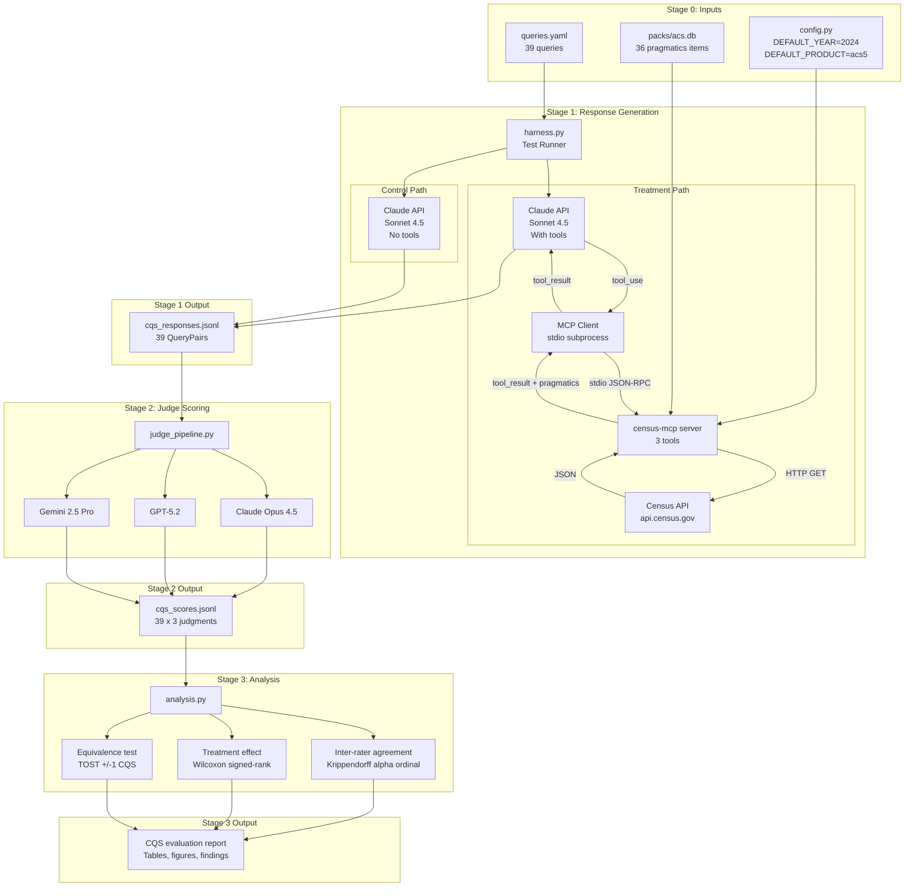

# Chapter 2: Test System Architecture

[← Ch. 1](01_purpose_scope.md) | [README](README.md) | [Ch. 3 →](03_configuration.md)

---

## 2.1 System Diagram

## 2.2 Component Inventory

| Component | File | Status | Description |
|---|---|---|---|
| Test battery | `src/eval/battery/queries.yaml` | ✅ Built | 39 queries, machine-readable |
| Server config | `src/census_mcp/config.py` | ✅ Built | Externalized defaults, env overrides |
| Pydantic models | `src/eval/models.py` | ✅ Built | ToolCall, ResponseRecord, QueryPair |
| MCP client | `src/eval/mcp_client.py` | ✅ Built | Subprocess lifecycle, tool dispatch |
| Agent loop | `src/eval/agent_loop.py` | ✅ Built | Control + treatment paths |
| Test harness | `src/eval/harness.py` | ✅ Built | CLI runner, JSONL output, resume |
| Judge pipeline | `src/eval/judge_pipeline.py` | ⬜ Not built | Stage 2 |
| Analysis | `src/eval/analysis.py` | ⬜ Not built | Stage 3 |
| Stats library | `src/eval/lib/stats.py` | ⬜ Not built | Copy from harmonization project |
