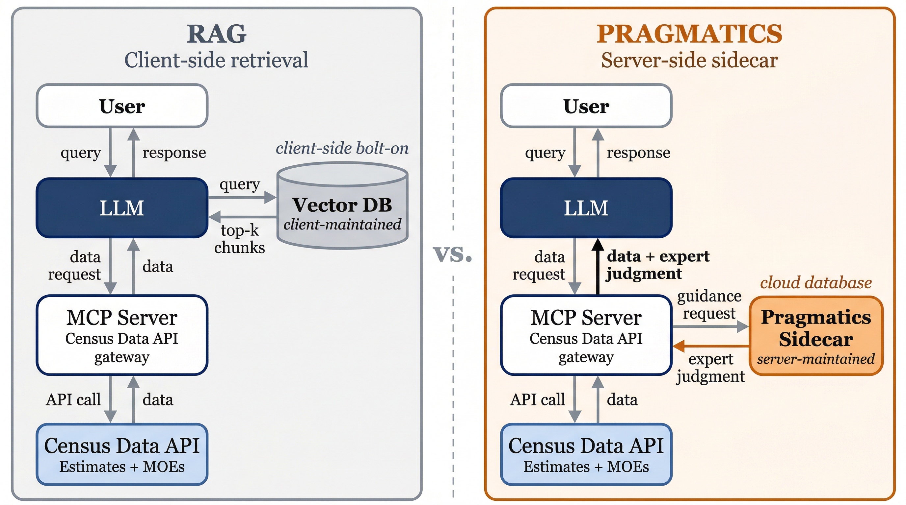

# Introduction

<!-- Registry references: SD-001, PL-001, S2-010, S2-011, S3-001–003 -->
<!-- Citation files: federal_data_evolution_arc.md, core_argument.md, nsf_norc_landscape.md -->

Federal statistical agencies have spent more than a decade making their data accessible to machines. Beginning with the Open Government Directive [@obama2009ogd] and accelerating through Executive Order 13642 [@eo13642], which made machine-readable formats the default for federal information, the investment has been substantial. The Census Bureau's API, the Bureau of Labor Statistics' data retrieval tools, and the standardized metadata schemas across Commerce Department statistical assets represent a mature infrastructure for both data access and data discovery. Variable descriptions, concept classifications, table schemas, and geographic hierarchies are documented and published. The syntax layer (how data is structured, formatted, and transmitted) and the semantics layer (what data products exist, what they measure, and how they are organized) are, for practical purposes, solved.

The rapid adoption of AI, and large language models (LLMs) in particular, has changed the equation. Models trained on large collections of text that include statistical documentation, methodology reports, and data dictionaries behave as if they have internalized much of this infrastructure. They can translate natural language questions into domain-appropriate queries, identify relevant variables, resolve geographic entities, and retrieve data through APIs: tasks that previously required specialized training or purpose-built search interfaces. Decades of federal investment in syntax and semantics are now partially encoded in model training data, which creates a new problem.

When a user asks a language model for the poverty rate in a small county, the model answers from its training data or, if web search is enabled, from whatever source it retrieves, with no guarantee that the source is authoritative or current. The appearance of a cited result compounds the problem by suggesting verification where none occurred. Without a purpose-built tool connecting the model to the Census API, there is no authoritative data retrieval at all, and such tools remain inaccessible to most users. Even when an authoritative data pipeline exists, the model cannot assess whether the estimate it delivers is reliable enough to use. It does not know that the margin of error may exceed the estimate itself, that the coefficient of variation renders the figure unsuitable for most analytical purposes, or that the five-year period estimate represents a 60-month weighted average rather than a point-in-time snapshot. The model delivers the number confidently. A non-expert user has no basis to question it.

The model is not missing information that could be retrieved from a document or looked up in a database. It is missing expert judgment about fitness for use: the kind of assessment that a senior statistician makes reflexively when evaluating whether a particular estimate is appropriate for a particular purpose. Because this judgment is tacit, it is rarely stated explicitly in documentation, which means it cannot be retrieved by a search system or encoded in training data. It lives in the professional practice of experienced statisticians and data scientists, accumulated through years of working with the data and its limitations.

We call this missing layer *pragmatics*, drawing on Charles Morris's [-@morris1938] semiotic framework that distinguishes syntax (the formal structure of signs), semantics (the relationship between signs and what they denote), and pragmatics (the relationship between signs and their interpreters, specifically the contextual judgment required for appropriate use). In the context of federal statistical data, pragmatics is the expert assessment of fitness for use that transforms a data retrieval into a statistical consultation.

This is not a new concept imposed from outside statistical practice. The Federal Committee on Statistical Methodology's own data quality framework [@fcsm2020] codifies three core domains (utility, objectivity, and integrity) that are fundamentally pragmatic in nature. They describe not what the data *is* but whether the data is *appropriate* for a given purpose. What has not existed, until now, is a mechanism to deliver this expert judgment computationally, at the point where a user or automated system is interpreting statistical data.

The current federal landscape reflects this gap. The National Science Foundation recently solicited proposals to measure how well language models understand federal statistical data, seeking empirical evaluations of LLM accuracy, relevancy, and explainability on government data assets [@ncses2025]. This and similar benchmarking initiatives share a common focus: measuring how well models perform on statistical tasks. These efforts characterize the gap. This paper addresses it.

This paper introduces pragmatics as a defined, implementable concept for federal statistical AI systems. We present a knowledge representation study comparing three conditions with identical data access: a control with no methodology support, retrieval-augmented generation (RAG) using document chunks from authoritative source material, and pragmatics using curated expert judgment items delivered at the point of statistical reasoning. The two treatment conditions draw from the same 354 pages of Census Bureau documentation, differing only in how that knowledge is represented and delivered; the control receives no methodology support. RAG retrieves text passages, but fitness-for-use judgment is synthesized across multiple sources and professional experience; it is not stated as a retrievable passage in any single document.

The results demonstrate that 36 curated pragmatics produce very large improvements in consultation quality relative to no support (Cohen's d = 1.440) and large improvements relative to RAG (d = 0.922), with the strongest effects on uncertainty communication, precisely the dimension where fitness-for-use judgment matters most. Pragmatic context achieves 91.2% fidelity to authoritative data sources compared to 74.6% for RAG, costing more per query than RAG but delivering 2.2 times more quality improvement per dollar spent.

The contribution is not a better retrieval system. It is a missing layer in the federal statistical data ecosystem, identified and tested, conceptually present in quality frameworks for decades but never delivered computationally. Making data AI-ready requires three things: refactoring how data is exposed to AI systems, accelerating metadata curation, and encoding the expert judgment needed to evaluate fitness for use. The first two are underway, and the third is the subject of this paper.

# The Semantic Smearing Problem

<!-- Registry references: RAG-001–007, EXT-001–010 -->
<!-- Citation files: ethayarajh_2019_anisotropy.md, semantic_smearing_evidence.md, stochastic_tax_framing.md -->

## Why Search Algorithms Struggle with Specialized-Vocabulary Metadata

@ethayarajh2019 demonstrated that the text representations used by search algorithms cluster in a narrow region of the search space rather than spreading out uniformly. In the upper layers of GPT-2, the average similarity between randomly sampled word representations approaches 0.99, meaning that even unrelated concepts appear nearly identical to the algorithm. The problem intensifies in specialized domains where thousands of variable descriptions already share the same demographic terms, geographic references, and survey language.

Federal statistical metadata is an extreme case of domain homogeneity. Census variable descriptions share a common vocabulary of demographic terms, geographic references, and survey methodology language. A variable measuring median household income in a county and a variable measuring per capita income in a metropolitan statistical area use many of the same words in similar syntactic patterns to describe related but distinct measurements. In embedding space, these descriptions cluster tightly; this is not because they mean the same thing, but because the embedding space cannot separate them.

## Empirical Evidence: The Enrichment Experiment

We tested this directly using a matched-pairs analysis of 2,500 Census variable descriptions across two embedding models. The experiment compared three representations of each variable: the raw Census label, the label combined with its concept metadata, and an LLM-enriched description incorporating full contextual text generated by a language model.

{#fig-smearing width=6.5in}

For the all-MiniLM-L6-v2 model (384 dimensions), group discrimination collapsed by 63.7%: the model could no longer reliably distinguish variables in the same conceptual group from variables in different groups. Think of each variable's embedding as a pixel with a distinct color. In the raw metadata space, red and blue remain separable. Enrichment compresses those pixels together until both appear purple. Mean pairwise cosine similarity increased 45.9% as a result: the representations did not spread out, they clustered together, pushing cross-group similarity into the range where RAG systems confidently retrieve the wrong chunks [@lewis2020rag].

The effect was worse with larger models: RoBERTa-large (1,024 dimensions) showed an 86.5% collapse in discrimination, demonstrating that higher dimensionality amplifies the problem rather than resolving it. The problem is not in the embedding model; it is in the text. Census methodology documentation uses a constrained vocabulary to describe a large number of related but distinct statistical products. Any embedding model operating on this text will produce representations that cluster in a narrow region of the space, because the text itself provides insufficient signal for geometric separation. Adding more text (enriching, expanding, paraphrasing) makes the problem worse by introducing additional shared vocabulary. We describe this phenomenon as *semantic smearing*: the representations of concepts that should remain distinct are smeared together across the embedding space, making retrieval systems unable to discriminate between them.

## Consequences for Retrieval-Based Approaches

Semantic smearing helps explain why retrieval-augmented generation underperformed expectations in this study. The structural conditions that produce it are not unique to the American Community Survey. Any federal statistical program describing thousands of related products with a shared vocabulary faces the same problem. Standard RAG systems retrieve document chunks by embedding the user's query and finding the nearest neighbors in the indexed corpus. When every document in the corpus uses the same specialized vocabulary, the search algorithm cannot reliably distinguish between passages that address different statistical products: returning a chunk about poverty thresholds when the query concerns poverty rates, or a passage about one-year estimates when the question requires five-year methodology.

GraphRAG systems attempt to address this by constructing knowledge graphs from source documents, using language models to extract entities and relationships that can be traversed during retrieval [@edge2024graphrag]. This graph construction is substantially more expensive than embedding-based indexing, requiring LLM calls for every document chunk to identify entities, relationships, and community summaries [@stamatescu2024graphragcosts]. The additional infrastructure does not address the underlying problem: when the source text uses a constrained vocabulary to describe related but distinct statistical products, the entities and relationships extracted from that text inherit the same ambiguity. The graph structure cannot discriminate where the text itself does not.

<!-- MOVED to Section 3: architectural comparison of query-time overhead. Pragmatics pays graph construction once at development time, then serves compiled results deterministically. RAG/GraphRAG incur retrieval overhead and variance at every query. -->

## The Judgment Gap

The semantic smearing problem reveals that the challenge facing AI systems in statistical domains is not primarily one of retrieval. Language models already perform the syntactic and semantic tasks (translating natural language into domain-appropriate API calls, identifying relevant variables, resolving geographic entities) with sufficient accuracy for practical use. The control condition in our evaluation demonstrates this: given API access, the model retrieves correct data in the majority of cases.

What models cannot do reliably is assess the fitness of the data they retrieve. They do not know when a margin of error renders an estimate unreliable, when a geographic nesting assumption does not hold, when a period estimate should not be compared to a point-in-time figure, or when the appropriate response is to decline to provide a number rather than deliver it with false confidence. This is not information that can be retrieved from a document chunk. It is expert judgment about appropriate use, and filling this gap requires a different kind of intervention than better retrieval.

# Pragmatics: Structured Expert Judgment

<!-- Registry references: PL-001, PL-004, DET-001–004 -->
<!-- Citation files: core_argument.md, federal_data_evolution_arc.md, d3_uncertainty_deep_dive.md -->

## The Semiotic Foundation

Charles Morris's [-@morris1938] *Foundations of the Theory of Signs* introduced a three-part framework for understanding how signs function: syntax concerns the formal relationships between signs, semantics concerns the relationship between signs and the objects they represent, and pragmatics concerns the relationship between signs and their interpreters, specifically the contextual conditions under which signs are appropriately used. Applied to federal statistical data, these three layers correspond to distinct infrastructure investments and distinct institutional responsibilities (@fig-semiotic-stack).

![The semiotic stack applied to federal statistical data, after Morris [-@morris1938]. Syntax and semantics are mature; pragmatics is the missing layer.](assets/diagrams/fig_semiotic_stack.png){#fig-semiotic-stack width=80%}

*Syntax* encompasses the structural layer: APIs, machine-readable formats, data transmission protocols, and the formal rules governing how data is organized and accessed. This is the domain of open data mandates, format standards, and programmatic access. It is mature.

*Semantics* encompasses the meaning layer: variable descriptions, concept classifications, geographic hierarchies, and the metadata that allows a consumer to identify what a data element represents. This is the domain of documentation, catalogs, and AI-ready data initiatives. It is well-developed and continues to improve.

*Pragmatics* encompasses the judgment layer: the expert assessment of whether a particular data element is appropriate for a particular use, given the specific context of the question being asked. This is the domain of experienced statisticians, methodology specialists, and data stewards. It does not exist as a computationally deliverable resource in any federal statistical system.

The three layers are cumulative, not substitutable. An agency that has invested in syntax and semantics has completed two of three necessary steps for responsible AI-mediated data access. The third step, encoding the fitness-for-use judgments that practitioners apply but have never formalized for machine delivery, is the subject of this paper. The distinction between semantics and pragmatics is critical to understanding why metadata alone is insufficient for statistical consultation.

| | Semantics | Pragmatics |
|---|---|---|
| **Answers** | What is this number? | Is this number fit for my purpose? |
| **Source** | Data dictionaries, API metadata | Methodology handbooks, technical documentation, expert judgment |
| **Example** | B19013_001E = median household income, inflation-adjusted dollars, ACS 5-year | MOE may render this estimate unreliable at pop. 8,000; 5-year = 60-month rolling average; comparing to decennial requires methodology reconciliation |

: Semantics versus pragmatics for a single Census variable. {#tbl-sem-vs-prag}

The semantic information is in the metadata. The pragmatic judgment is scattered across methodology documentation, disconnected from the data it governs, or exists as tacit expertise that experienced statisticians apply but have never formalized.

## What a Pragmatic Is

A pragmatic is a structured unit of expert judgment about fitness for use. It is not an instruction, a rule, a constraint, or a lookup table. It is a factual statement of the kind a senior statistician would make to a colleague before they use a particular data product: the professional assessment that transforms a data retrieval into a statistical consultation. Each pragmatic has five structural components, illustrated in @fig-anatomy using ACS-MOE-002, the coefficient of variation reliability threshold.

{#fig-anatomy fig-pos="H" width=80% height=80%}

### Context Text

Context text is the judgment itself, expressed in one to three sentences as factual expert knowledge. For example: "When the coefficient of variation exceeds 40 percent, the American Community Survey estimate is considered unreliable for most analytical purposes. The coefficient of variation is calculated as the ratio of the standard error to the estimate, where the standard error is derived from the margin of error divided by 1.645." This is not an instruction telling the model what to do. It is expert knowledge about what the data means, provided at the moment the model is interpreting a specific result.

### Latitude

{#fig-latitude}

Latitude calibrates how much interpretive freedom the model has when applying a judgment. Some statistical rules carry no flexibility: delivering an estimate from a geography that violates the minimum population threshold is harmful regardless of context. Others involve genuine tradeoffs where the right answer depends on the analytical purpose, and constraining the model to a single answer would make it less useful. Latitude encodes this distinction explicitly, so that hard rules arrive as hard rules and context-dependent guidance arrives as context to reason over rather than a constraint to follow. This connects to the observation in @kahneman2021 that professional experts exhibit significant variance in judgments that are nominally deterministic: latitude structures that variance intentionally rather than leaving it implicit in the judgment text.

### Triggers

Triggers are three to six keywords that activate retrieval when the item is relevant to a query. Triggers are authored to reflect how practitioners describe problems rather than how documents index topics, ensuring that a query about "small county poverty data" activates the reliability threshold item even though the query contains none of the technical vocabulary in the item text.

### Thread Edges

Thread edges connect related items into coherent retrieval bundles. When a user asks about small-area estimates, the system retrieves not just the reliability threshold item but also the margin-of-error interpretation item and the period-estimate caveat, the complete set of judgments a statistician would provide together. Thread structure ensures that pragmatic context arrives as a coherent professional assessment rather than isolated facts.

### Provenance

Provenance traces every judgment to its authoritative documentary source: the specific document, section, and page from which the expert knowledge was derived or against which it was validated. This enables audit of every claim in the system back to Census Bureau publications.

## What Pragmatics Are Not

Pragmatics are deliberately distinct from several related concepts:

They are not *retrieval-augmented generation*. RAG retrieves text passages from a document corpus by finding the nearest neighbors to a query embedding: a search over continuous similarity scores that returns different results depending on the embedding model, index state, and query phrasing. Pragmatics delivers structured expert judgment selected by exact topic match: the same query topic always returns the same items. More importantly, the content differs. RAG surfaces text that is semantically related to the query; pragmatics surfaces judgment that is specifically applicable to it. Related text and applicable judgment are not the same thing, and the gap between them is precisely what Section 2 describes.

They are not *prompt engineering*. Pragmatic content is domain knowledge, not model instructions. The system does not tell the model to "always warn about margins of error"; instead, it provides the expert knowledge that margins of error exceeding the estimate indicate unreliability, and allows the model's reasoning to incorporate that knowledge as it would incorporate any factual context.

They are not *an ontology*. The system does not attempt to represent the full relational structure of Census concepts, variables, geographies, and survey products. Language models already approximate this structure in their training data representations. Pragmatics provide the judgment layer that models cannot derive from relational structure alone.

They are not *constraints or guardrails*. The latitude system explicitly encodes where the model has freedom to exercise judgment. A wide-latitude item is not a rule to follow but context to consider. This reflects the reality that statistical consultation often involves professional judgment calls where multiple positions are defensible.

## Deterministic Delivery

A defining property of the pragmatics retrieval mechanism is determinism. When a query's topic is identified, the system maps it to a thread identifier, follows pre-compiled edges in a SQLite database, and returns the associated context items. This is a lookup, not a search. The same topic always produces the same context set.

This property was verified empirically across two independent replications of the full 39-query test battery plus the original evaluation run. All 39 queries produced identical context retrievals across all three runs, with zero mismatches. The determinism is not a tuned property or a statistical regularity but a structural consequence of replacing similarity search with a compiled lookup.

The practical significance is architectural. RAG and GraphRAG systems incur retrieval overhead at every query: embedding lookups, similarity computations, or graph traversals that can return different results as indices are updated, models are versioned, or parameters change. This retrieval variance compounds with the inherent stochasticity of language model generation, producing variance at two stages of the pipeline. Pragmatics eliminates this compounding by paying the construction cost once, at development time, then serving compiled results from a static database at query time. Each query has zero retrieval variance and negligible retrieval overhead. In domains where the difference between a one-year and five-year estimate determines whether an answer is useful or harmful, this architectural property matters.

# Method

<!-- Registry references: SD-001–010, PL-001–004, RAG-001–007, EXT-001–010, DET-001–004, DRV-001–004 -->
<!-- Existing section: 05_extraction_pipeline.md (subsume relevant parts) -->

## Study Design

We conducted a knowledge representation study comparing three experimental conditions with identical data tool access. The single independent variable was the form of methodology support provided to the language model during statistical consultation. All three conditions used the same caller model (Claude Sonnet 4.5), the same open-source MCP server for Census data retrieval [@webb2025censusmcp], and the same 39-query test battery. The conditions differed only in how domain knowledge was represented and delivered (@fig-design).

{#fig-design fig-pos="H" width=80%}

*Control.* The model received access to the Census data MCP server with no methodology support. This represents the baseline capability of a capable language model performing statistical consultation with data access but no expert guidance.

*RAG (Retrieval-Augmented Generation).* The model received access to the Census data MCP server plus retrieved document chunks from authoritative source material. For each query, the top five most similar chunks were retrieved from a FAISS index (IndexFlatIP, cosine similarity) using the all-MiniLM-L6-v2 embedding model (384 dimensions) over 311 chunks extracted from three Census Bureau publications using section-aware chunking at a 2,000-token maximum (Docling HierarchicalChunker).

*Pragmatics.* The model received access to the Census data MCP server plus curated expert judgment delivered through a methodology guidance tool. For each query, the system performed a deterministic lookup against a compiled SQLite pack of 36 curated pragmatics, matching query topics to pre-compiled thread edges with no live graph dependency.

The three source documents were identical across the RAG and pragmatics conditions: the ACS General Handbook 2020 (89 pages), the ACS Design and Methodology Report 2024 (238 pages), and the ACS Geography Handbook 2020 (27 pages), totaling 354 pages. RAG indexed all three as 311 chunks. Pragmatics drew 36 curated items from the same sources: 34 through pipeline extraction and 2 through manual author review. The independent variable was representation method, not source material.

We controlled tool access through distinct configurations for each condition. The control and RAG conditions were explicitly denied access to the methodology guidance tool, verified post-hoc through tool call auditing. The pragmatics condition included a grounding gate requiring consultation of methodology guidance before interpreting any data, verified at 100% compliance across all 39 queries.

## Test Battery

The test battery comprised 39 queries stratified into 15 normal queries (38%) and 24 edge cases (62%). The stratification was derived from a power analysis: paired Wilcoxon signed-rank tests at a target effect size of d = 0.5, significance level α = 0.05, and power = 0.80 require approximately 35 pairs. The battery was stratified to provide sufficient power for both equivalence testing on normal queries (where pragmatics should not harm performance) and superiority testing on edge cases (where the pragmatics effect was hypothesized to concentrate).

Edge cases were drawn from seven categories reflecting known failure modes in statistical consultation: geographic edge cases (7 queries), small-area reliability concerns (4), temporal comparison issues (4), ambiguous requests (3), product mismatches (3), and persona-varied queries (3). This distribution weighted the battery 80% toward challenging scenarios where fitness-for-use judgment is most critical, consistent with the hypothesis that pragmatics address judgment gaps rather than knowledge gaps.

## Pragmatics Extraction Pipeline

The 36 pragmatics were produced through two extraction pathways from the same source documents used by the RAG condition.

*Pipeline extraction.* This pathway produced 34 items. Source documents were processed through section-aware chunking, yielding structured text segments passed through LLM-based extraction to populate a knowledge graph of 5,233 nodes. From this graph, pragmatics were harvested through pattern-matching against the FCSM 20-04 quality framework, then curated by a domain expert who assigned latitude levels, retrieval triggers, thread edges, and provenance citations. The extraction yield was 0.65%: each surviving item encodes a specific fitness-for-use judgment, stripped of the surrounding exposition that dilutes signal in chunk-based retrieval.

*Manual extraction.* This pathway produced 2 items through author review of source material. The Geography Handbook yielded zero usable items through the pipeline; this finding suggests that some expert judgment is implicit in how practitioners use documents rather than explicit in any single passage. The two manually extracted items (geographic hierarchy judgment and group quarters classification) originated from the author's experience working with Census geographic data and reflect tacit knowledge that documents do not state directly. This pathway is by design: the architecture anticipates that domain experts will contribute judgment through structured review of scenarios where the system fails or provides incomplete guidance, expanding the pragmatics catalog beyond what pipeline extraction from documentation alone can produce.

The authoring-to-runtime pipeline implements strict separation of concerns. Items are authored in a graph database, exported to version-controlled JSON staging files, validated against a canonical schema, and compiled to a SQLite database: the deployable pack that the server loads at runtime. The runtime system has no dependency on the graph database, extraction pipeline, or authoring workflow.

## Evaluation Pipeline

Evaluation proceeded through three stages (@fig-pipeline).

{#fig-pipeline}

*Stage 1: Response Generation.* This stage produced 117 responses: 39 queries across 3 conditions. Each query was processed by the caller model with the condition-specific tool configuration, producing a complete statistical consultation response.

*Stage 2: Consultation Quality Scoring.* Response quality was assessed through pairwise comparison using three independent judge models (Anthropic Claude, OpenAI GPT, Google Gemini). Each pair of conditions was evaluated across five quality dimensions: accuracy of statistical claims (D1), completeness of relevant information (D2), appropriate communication of uncertainty (D3), clarity of explanation (D4), and avoidance of potentially harmful misinterpretation (D5). Each comparison was scored by all three judges in both presentation orders, yielding six passes per comparison. This produced 2,106 total judge records (39 queries × 3 comparisons × 3 judges × 2 orderings) with zero parse failures. Inter-judge agreement, measured by Kendall's W on vendor-level CQS medians, was 0.551 (control, p = .007), 0.618 (pragmatics, p = .001), and 0.735 (RAG, p < .001). The lower concordance on control responses is consistent with judges having less structured content to anchor scoring; vague responses produce greater rater disagreement, a pattern also observed in chatbot arena evaluations [@zheng2023judging].

Quality dimensions were scored on a three-point scale (0, 1, 2) where 0 indicates the first response is clearly better, 1 indicates a tie, and 2 indicates the second response is clearly better. Scores were normalized to a [-1, +1] scale for analysis, with positive values indicating the second-listed condition performed better. A CQS of +1.0 indicates consistent preference for the treatment condition across all dimensions and judges; 0.0 indicates no aggregate preference.

*Stage 3: Pipeline Fidelity Verification.* This stage assessed whether responses accurately reported what Census API tools returned. An automated verification system extracted factual claims from each response and traced them to specific API calls, checking whether cited estimates, margins of error, geographic entities, and variable codes matched the actual tool responses. This stage measured auditability (whether claims could be verified at all) and fidelity (whether verified claims were accurate). Stage 2 judges had no access to Stage 3 outputs; the two stages ran independently to prevent fidelity results from influencing quality assessments.

## Statistical Analysis

Composite Consultation Quality Scores (CQS) were computed as the mean across five dimensions for each query-comparison-pass combination, then averaged across the six passes to produce a single score per query per comparison.

The Friedman test for related samples was used to determine whether any condition differed from any other before examining specific pairs. Pairwise comparisons used Wilcoxon signed-rank tests with Holm-Bonferroni correction. Effect sizes were computed as paired Cohen's d and rank-biserial correlation (r) from the Wilcoxon signed-rank statistic. Cohen's d is reported for comparability with prior work; rank-biserial r is the appropriate nonparametric effect size for the bounded ordinal CQS composite, interpretable as the proportion of query pairs favoring the treatment condition. Bootstrap confidence intervals (10,000 iterations) provided uncertainty estimates for mean differences. Stratum-level analyses tested whether effects differed between normal and edge case queries using permutation tests on the difference-of-differences.

The evaluation design aligns with the NIST AI Risk Management Framework's [@nist2023airm] Test, Evaluation, Verification, and Validation (TEVV) methodology. A crosswalk mapping CQS dimensions to FCSM 20-04 quality characteristics and NIST AI RMF trustworthiness properties is available as a separate publication [@webb2026crosswalk].

# Results

<!-- Registry references: S2-001–042, S3-001–012, SA-001–022, EFF-001–008, COST-001–013, DET-001–004 -->

## Overall Consultation Quality

The Friedman test revealed a significant difference across the three conditions (χ²(2, N = 39) = 42.01, p < 0.001). All three pairwise comparisons were significant after Holm-Bonferroni correction.

| Condition | Mean CQS | *n* |
|-----------|----------|-----|
| Pragmatics | 1.528 | 39 |
| RAG | 1.144 | 39 |
| Control | 0.990 | 39 |

: CQS composite scores by condition (D1–D5 mean of per-query medians). {#tbl-cqs-means}

| Comparison | Statistic | *r* | 95% CI | *p* | Eff. *n* |
|------------|-----------|-----|--------|-----|----------|
| Friedman omnibus | χ²(2) = 42.01 | — | — | < .001 | 39 |
| Pragmatics vs Control | Δ = +0.538, d = 1.440 | 0.938 | [0.421, 0.651] | < .001 | 36 |
| Pragmatics vs RAG | Δ = +0.385, d = 0.922 | 0.754 | [0.256, 0.513] | < .001 | 32 |
| RAG vs Control | Δ = +0.154, d = 0.546 | 0.378 | [0.072, 0.244] | .002 | 30 |

: Friedman omnibus and Wilcoxon signed-rank pairwise comparisons with Holm–Bonferroni correction. *r* = rank-biserial correlation from Wilcoxon statistic. Bootstrap 95% CIs (10,000 iterations) on CQS deltas. {#tbl-pairwise}

Pragmatics produced a very large improvement over the control condition (Δ CQS = +0.538, d = 1.440, r = 0.938, 95% CI [0.421, 0.651], p < 0.001) and a large improvement over RAG (Δ CQS = +0.385, d = 0.922, r = 0.754, 95% CI [0.256, 0.513], p < 0.001). RAG produced a medium improvement over control (Δ CQS = +0.154, d = 0.546, r = 0.378, 95% CI [0.072, 0.244], p = 0.0017). The rank-biserial r of 0.938 indicates that pragmatics outperformed control on 94% of query pairs. Mean composite scores were 1.528 (pragmatics), 1.144 (RAG), and 0.990 (control). The ordering was consistent: pragmatics outperformed RAG, which outperformed control, across every level of analysis.

## Per-Dimension Effects

Effect sizes varied substantially across the five quality dimensions (@fig-effect-sizes).

{#fig-effect-sizes width=6.5in}

| Dimension | Prag vs Ctrl *d* | Prag vs RAG *d* | RAG vs Ctrl *d* |
|-----------|-----------------|-----------------|-----------------|
| D1 (Accuracy) | 0.541 | 0.515 | 0.190 |
| D2 (Completeness) | 0.537 | 0.297 | 0.246 |
| D3 (Uncertainty Communication) | **1.353** | **1.040** | 0.417 |
| D4 (Contextual Clarity) | **0.957** | 0.577 | 0.546 |
| D5 (Reproducibility & Traceability) | 0.732 | 0.521 | 0.148 |

: Per-dimension Cohen's *d* effect sizes. Bold indicates *d* > 0.8 (large). {#tbl-dimension-effects}

All five quality dimensions showed significant effects (p < 0.001 for each). The effect sizes for pragmatics versus control varied across dimensions, revealing where expert judgment matters most:

Uncertainty communication (D3) showed the largest effect (d = 1.353 vs. control, d = 1.040 vs. RAG). This dimension captures whether responses appropriately communicate reliability limitations, margins of error, and data fitness: the core of what pragmatics are designed to deliver. The magnitude of this effect is consistent with the mechanism: pragmatics encode specific reliability thresholds, interpretation formulas, and informed-refusal criteria that the model cannot derive from training data or retrieved document chunks.

Clarity of explanation (D4) showed the second-largest effect (d = 0.957 vs. control), while accuracy (D1, d = 0.541), completeness (D2, d = 0.537), and reproducibility (D5, d = 0.732) showed medium to large effects. The consistency across all five dimensions indicates that pragmatics improve the overall quality of statistical consultation rather than optimizing a single aspect.

RAG showed its largest advantage over control on clarity (D4, d = 0.546) and uncertainty (D3, d = 0.417), with smaller effects on accuracy (D1, d = 0.190) and reproducibility (D5, d = 0.148). The pattern suggests that retrieved document chunks provide some contextual value but lack the expert guidance to substantially improve reliability assessment or harm prevention.

## Stratum Analysis: Normal vs. Edge Cases

The evaluation was stratified to test whether pragmatics disproportionately help on edge cases (queries involving small areas, geographic exceptions, temporal comparisons, and ambiguous requests) or whether benefits extend to routine statistical queries.

| Comparison | Normal *d* (*n*=15) | Edge *d* (*n*=24) | Δ*d* (Edge−Normal) | *p* (Edge > Normal) |
|------------|--------------------|--------------------|---------------------|---------------------|
| Prag vs Ctrl | **2.347** | 1.135 | -0.273 | .987 |
| Prag vs RAG | **1.436** | 0.683 | -0.318 | .987 |
| RAG vs Ctrl | 0.458 | 0.590 | +0.044 | .347 |

: Stratum analysis comparing normal (*n*=15) and edge-case (*n*=24) queries. Δ*d* is the delta-of-deltas (edge minus normal mean CQS delta). Mann-Whitney *p* tests whether edge deltas exceed normal deltas. {#tbl-stratum}

Pragmatics showed a *larger* effect on normal queries (d = 2.347 vs. control, d = 1.436 vs. RAG) than on edge cases (d = 1.135 vs. control, d = 0.683 vs. RAG). Permutation testing confirmed that edge cases did not benefit disproportionately (p = 0.987 for pragmatics vs. control).

This finding is inconsistent with an overfitting explanation. Pragmatics do not merely catch exotic failure modes; they improve routine statistical consultation by providing the fitness-for-use context that even straightforward queries benefit from. A normal query about median household income in a large county still benefits from knowing that the five-year estimate is a 60-month average and that the margin of error defines a 90% confidence interval. Direct comparison to decennial census figures requires methodological adjustment that the model cannot infer without guidance.

The normal-stratum finding should be interpreted with a power caveat: at n = 15, the Wilcoxon test has approximately 0.56 power to detect a d = 0.5 effect. The observed effects (d = 2.347) are large enough to detect at this sample size, but RAG versus control on normal queries (d = 0.458, p = 0.137) was not significant, consistent with underpowering rather than a null effect. The between-group comparison uses Mann-Whitney U because the 15 normal and 24 edge-case queries are independent groups. Within each group, per-query deltas are computed from paired conditions (the same query tested under each treatment). The comparison across groups treats those deltas as independent samples.

## Pipeline Fidelity

Stage 3 automated verification assessed whether responses accurately reported what Census API tools returned, measuring both auditability (whether claims could be traced to specific API calls) and fidelity (whether traced claims were accurate).

| Condition | Claims | Fidelity | Subst. Fidelity | Error Rate | Auditable |
|-----------|--------|----------|-----------------|------------|-----------|
| Pragmatics | 353 | 91.2% | 99.7% | 0.3% | 29.5% |
| RAG | 355 | 74.6% | 98.9% | 0.8% | 6.2% |
| Control | 253 | 78.3% | 100.0% | 0.0% | 21.8% |

: Stage 3 fidelity verification. Fidelity = (matched + calculation_correct) / total_claims. Substantive fidelity excludes no_source claims. Error rate = (mismatched + calculation_incorrect) / total_claims. Auditable = fully auditable claims / substantive claims. {#tbl-fidelity}

Pragmatics achieved 91.2% fidelity across 353 claims, compared to 74.6% for RAG (355 claims) and 78.3% for control (253 claims). Substantive fidelity (the rate among claims that could be fully verified) was high across all conditions: 99.7% for pragmatics, 98.9% for RAG, and 100.0% for control. Control's perfect rate reflects a smaller denominator, not greater accuracy. With the fewest total claims and the lowest auditability (21.8%), control responses avoided errors by avoiding specificity. Pragmatics made more claims than control, with higher auditability, and still achieved near-perfect substantive fidelity: more specific, more verifiable, and comparably accurate. The control condition's lower claim count (253 vs. 353) illustrates the inverse: without methodology support, models produce vaguer responses that are harder to verify not because they are wrong but because they are not specific enough to check. Vagueness is not accuracy; it is the absence of accountability.

The fidelity gap between pragmatics and RAG (16.6 percentage points) reflects a structural difference. Pragmatics provide specific criteria for interpreting data, leading the model to make more precise and verifiable claims. RAG-retrieved chunks provide general context that can lead the model to make claims that are plausible but difficult to verify or subtly misaligned with the specific data returned.

Pragmatics' middling auditability (29.5%) despite its highest fidelity reflects a complementary pattern: structured expert judgment encourages conditional and interpretive claims (e.g., "unreliable if CV exceeds 40%") that are methodologically sound but cannot be traced to a specific API return value. High fidelity with moderate auditability indicates precise claims grounded in methodology rather than in raw data alone.

## Determinism

Pragmatic context retrieval was 100% deterministic across all 39 queries, verified through two independent replications producing zero mismatches with the original evaluation run. Given identical topic parameters, the SQLite lookup returns identical context sets every time. This determinism is a structural property of the retrieval mechanism (SQLite lookup rather than similarity search), not a statistical regularity of the evaluation.

## Cost and Efficiency

Pragmatics costs more per query than RAG but delivers substantially more quality improvement per dollar spent. Beyond per-query economics, the total cost of ownership favors pragmatics: no vector database, no embedding model, and no index maintenance at runtime.

Pragmatics incurred higher per-query token costs than RAG. Mean input tokens per query were 32,929 for pragmatics, 23,746 for RAG, and 5,830 for control, reflecting the structured context delivered alongside data. At Claude Sonnet 4.5 pricing ($3/$15 per million tokens input/output), per-query costs were $0.113 (pragmatics), $0.082 (RAG), and $0.028 (control).

| Metric | Control | RAG | Pragmatics |
|--------|---------|-----|------------|
| **Sonnet 4.5** ($3/$15 per MTok) | | | |
| Cost per query | $0.028 | $0.082 | $0.113 |
| Marginal cost vs control | — | $0.054 | $0.086 |
| CQS per marginal $ | — | 2.83 | **6.28** |
| **Opus 4.6** ($5/$25 per MTok) | | | |
| Cost per query | $0.046 | $0.137 | $0.189 |
| Marginal cost vs control | — | $0.090 | $0.143 |
| CQS per marginal $ | — | 1.70 | 3.77 |
| | | | |
| Cost-effectiveness ratio (Prag/RAG) | — | — | **2.2×** |

: Cost analysis at two pricing tiers. Marginal cost = condition cost minus control baseline. CQS per marginal dollar = CQS improvement over control / marginal cost per query. Cost-effectiveness ratio is constant across pricing tiers. {#tbl-cost}

Cost-effectiveness, measured as quality improvement per marginal dollar relative to control, favored pragmatics at 2.2 times the cost-effectiveness of RAG (6.28 vs. 2.83 quality points per marginal dollar). Pragmatics costs 38% more per query than RAG but delivers disproportionately more quality improvement. The 2.2x ratio assumes quality points are linearly valued. In practice, moving a response from harmful to adequate likely has greater utility than moving from adequate to excellent, so the ratio should be read as a relative comparison rather than a precise welfare measure.

These figures reflect token costs only. The runtime infrastructure is a SQLite file served via an API call, and the full 39-query evaluation cost $4.42 at production rates. The total cost of ownership is dominated by the one-time authoring investment, not ongoing infrastructure.

# Discussion

<!-- Registry references: S2-010–012, S2-032, SA-001–022, COST-001–013, EFF-001–008, DET-001–004 -->
<!-- Citation files: core_argument.md, stochastic_tax_framing.md, rag_graphrag_cost_comparison.md, d3_uncertainty_deep_dive.md -->

## Selectivity Beats Volume

36 curated expert judgment items outperform 311 document chunks retrieved from the same source material, with a large effect size (d = 0.922) and a 16.6 percentage point fidelity advantage. Both conditions drew from the same 354 pages of Census Bureau documentation. The difference is entirely in how that knowledge was represented and delivered.

Information selectivity at inference time follows the same pattern as training data curation. The machine learning community has established that curated, high-quality training datasets outperform larger, noisier corpora. Curating training data reduces variance in what a model learns; curating reasoning traces reduces variance in how a model reasons. This study provides evidence that the selectivity principle extends to inference-time expert knowledge: curating judgment at the point of decision reduces variance in what a model concludes. Existing retrieval architectures address this layer by amassing extracted information rather than distilling expert judgment.

The extraction yield (34 pipeline-extracted items from 5,233 knowledge graph nodes, a 0.65% retention rate) is not a limitation to be overcome through automation; it is the mechanism. Each reduction step in the pipeline (source documents $\to$ graph nodes $\to$ harvested candidates $\to$ curated items) removes content that is semantically related but pragmatically irrelevant. The final 36 items represent the distilled judgment that a senior statistician would actually provide at the point of data interpretation, stripped of the exposition, background, and procedural detail that constitutes the majority of methodology documentation.

The D3 (uncertainty communication) results provide the clearest illustration. This dimension showed the largest effect across all five quality dimensions (d = 1.353 vs. control, d = 1.040 vs. RAG) because it depends most directly on fitness-for-use judgment. RAG can retrieve a passage explaining what a margin of error is. Pragmatics deliver the specific judgment that *this* margin of error renders *this* estimate unreliable for *this* use case. The distinction between retrieving information about uncertainty and delivering judgment about uncertainty is the distinction between semantics and pragmatics.

This pattern also addresses whether the evaluation instrument structurally favors the pragmatics condition. If the CQS rubric simply rewarded any mention of uncertainty or methodology, RAG should benefit equally: it retrieves the same source material containing the same discussions of margins of error, reliability thresholds, and fitness-for-use considerations. RAG does benefit, but modestly (d = 0.417 on D3 vs. control). The differential is not that pragmatics mentions uncertainty and RAG does not; it is that pragmatics communicates uncertainty correctly and specifically for the query at hand.

## Reducing the Stochastic Tax

Every generative AI system pays a stochastic tax: variance at every stage of the pipeline that cannot be eliminated because the underlying generation mechanism is non-deterministic. The practical question is not whether variance exists but where it accumulates and how much of it is avoidable.

Production RAG and GraphRAG systems can compound variance at two stages. Retrieval introduces variability across deployments: embedding model upgrades, index reconfiguration, and corpus changes can alter which documents are returned for identical queries. Generation adds its own variance, as the same context can produce different outputs under standard sampling. When both stages vary, the compounding effect produces inconsistent grounding for inconsistent reasoning. The experimental RAG condition in this study used a fixed FAISS index with deterministic top-k retrieval, isolating the comparison to representation quality rather than retrieval stability. The architectural argument applies to deployed systems where index maintenance and embedding drift are operational realities.

Pragmatics eliminates one source of this compounding. Both conditions produced deterministic retrieval in the experiment, but RAG's determinism depends on a fixed index, embedding model, and configuration. Change any component and the retrieved context shifts. Pragmatics retrieval is structurally deterministic: a SQLite lookup that returns identical results regardless of model upgrades or infrastructure changes, verified at 100% across all 39 queries and two independent replications.

Proper interpretation of statistical estimates depends on expert knowledge that varies by product, geography, and vintage. The difference between a one-year and five-year estimate, or between a 20% and 40% coefficient of variation, determines whether an answer is useful or harmful. Stochastic retrieval in a domain exhibiting the semantic smearing described in Section 2 means the grounding itself is less reliable. Deterministic delivery of curated judgment eliminates this failure mode.

## The Sidecar Architecture

The empirical results demonstrated that injecting curated, expert judgment into the context window improves response quality; the delivery architecture determines whether that improvement scales. Pragmatics are served as a centralized API resource alongside the data itself. When a client model requests methodology guidance, the server performs a deterministic SQLite lookup, bundles the relevant context items, and returns them alongside the Census data response. The client receives expert judgment as structured data in the same response envelope as the statistical estimates. No client-side infrastructure is required: no vector database, no embedding model, no index to build or maintain. The service appreciates as more pragmatics are curated: each new item immediately benefits every client consuming the API.

This sidecar pattern inverts the cost structure of retrieval-based approaches. RAG requires each client to maintain its own chunked index: acquiring source documents, choosing a chunk strategy, embedding with a specific model, hosting a vector store, and re-indexing when any component changes. GraphRAG adds graph database infrastructure to the existing vector store requirements. Both approaches scale infrastructure linearly with the number of clients.

{#fig-sidecar width=6.5in}

The RAG condition in this study used section-level chunking with minor overlap, a standard configuration for document collections with clear hierarchical structure. A stronger RAG baseline (hybrid lexical-dense retrieval, reranking, domain-tuned embeddings) would likely narrow the gap. But this objection reinforces the pragmatics argument: every RAG tuning decision (chunk size, overlap, embedding model, reranking strategy, metadata filtering) represents engineering overhead that is fragile to model updates and must be re-validated when any component changes. An agency that invests months optimizing its RAG pipeline faces re-tuning when the next embedding model releases. Pragmatics sidesteps this treadmill entirely: the expert judgment is represented as structured data, not as embedding-dependent retrieval, and survives model transitions without re-indexing.

The deployment burden falls somewhere. Pragmatics places it where it is lightest: the agency publishes a compiled pack (a SQLite file served via API) containing curated expert judgment. No embedding model, no vector store, no index. The consumer's model receives structured context alongside the data response. The agency's operational burden reduces to maintaining a database of expert judgment, a structured version of the methodology documentation it already produces. The alternatives are heavier. If each consumer builds their own methodology-aware retrieval pipeline, every organization independently acquires source documents, chunks them, embeds them, hosts a vector store, and maintains an index; Census provides nothing beyond the PDFs it already publishes. If the agency hosts a RAG endpoint instead, it assumes responsibility for embedding models, vector databases, and index maintenance alongside its existing data APIs, a significant operational expansion for a statistical agency.

Pragmatics concentrates the authoring cost (one expert curates the pack) and distributes the benefit through a negligible-cost API call. Domain experts update the pack centrally; all clients benefit immediately. The runtime cost is a SQLite file read. As input token costs decline across model generations, the absolute cost of delivering expert judgment decreases. The quality advantage is structural rather than cost-dependent, and remains stable.


## Implications for Federal Statistical Agencies

The pragmatics concept does not compete with existing efforts. Continued investment in machine-readable formats, structured APIs, and rich metadata is essential; these ensure that syntax and semantics continue to be available in model training data and through programmatic access. Pragmatics complement this infrastructure by adding the layer that syntax and semantics cannot provide: the expert assessment of whether data is appropriate for a specific purpose.

The practical path forward involves packaging statistical expertise as a deliverable resource alongside data products. Not as documentation that users may or may not read, but as structured, machine-deliverable judgment that reaches the point of analysis automatically. The statistically significant improvements in consultation quality represent a positive return on a modest curation investment relative to the documentation agencies already produce. The expert judgment already exists in the professional practice of experienced statisticians; the task is to capture it, structure it, and deliver it alongside the data.

The evaluation infrastructure developed for this study, the CQS rubric, the 39-query battery, and the multi-vendor judge pipeline, constitutes a reusable benchmark instrument for LLM statistical competency evaluation. NCSES has separately commissioned work through America's DataHub Consortium to evaluate LLM understanding of federal statistical data [@ncses2025]. The present study suggests that measuring understanding may be insufficient without a mechanism to correct it at the point of decision.

Delivering fitness-for-use judgment is not a new obligation. The Federal Committee on Statistical Methodology's own data quality framework codifies three core domains that are fundamentally about fitness for use: utility, objectivity, and integrity. These build on decades of federal quality assurance practice. What pragmatics operationalizes is the delivery of this existing institutional knowledge through the channels where data consumers increasingly encounter federal statistics: AI systems increasingly embedded throughout the survey lifecycle. A published crosswalk between FCSM 20-04 and the NIST AI Risk Management Framework provides a coordination tool for agencies navigating both quality and trustworthiness requirements simultaneously [@webb2026crosswalk].

# Limitations and Future Work

<!-- Registry references: SD-001, SD-009, SD-010, PL-001, SA-003 -->

## Limitations

*Single domain.* The evaluation was conducted exclusively on the American Community Survey. While the architecture is domain-agnostic, the pragmatic content is domain-specific by design. Extending to other federal surveys (Current Population Survey, Survey of Income and Program Participation, decennial census) requires domain-specific curation.

*Single caller model.* All Stage 1 responses were generated by a single model (Claude Sonnet 4.5). Although the multi-vendor judge panel (Anthropic, OpenAI, Google) validates that quality assessments are not model-specific, the interaction between pragmatic context and different caller model architectures has not been tested. Models with different training data distributions may respond differently to the same expert judgment items.

*Sample size.* The battery of 39 queries provides adequate power for the observed large effects but limits detection of small effects, particularly in the normal stratum (n = 15, power ≈ 0.56 at d = 0.5). The RAG versus control comparison on normal queries (d = 0.458, p = 0.137) may reflect underpowering rather than a true null. Larger batteries would enable finer-grained analysis of which query types benefit most from each knowledge representation.

*Single curator.* The 36 pragmatics were curated by one domain expert. While they were validated against authoritative documentation and the provenance chain is fully auditable, the curation reflects one practitioner's judgment about what fitness-for-use knowledge matters most. Different experts might prioritize different items or assign different latitude levels. The scalability of hand curation is unproven, though the architecture supports multi-contributor workflows.

*LLM-as-judge.* Quality assessment used language models as judges, with biases mitigated through multi-vendor scoring, counterbalanced presentation order, and six passes per comparison. Counterbalanced ordering and multi-pass scoring directly address known order sensitivity and verbosity bias in LLM judges. The residual concern is that pragmatics may induce more structured responses, and judge models may reward well-organized presentation independent of whether the content is accurate. However, factual accuracy was verified independently through the Stage 3 fidelity pipeline, which compared response claims against Census API ground truth without relying on judge evaluation. Author spot checks confirmed alignment with judge scores, but a future study is planned to assess the value of pragmatics through expert review and to elicit additional judgment for refining the catalog.

*Upstream topic identification.* The determinism reported in Section 5 applies to the SQLite lookup given a topic identifier. The upstream step, mapping a natural-language query to a topic identifier, is performed by the caller model and is not deterministic. If the model misidentifies the query topic, the correct pragmatics will not be retrieved regardless of the retrieval mechanism's determinism. The evaluation held the caller model constant, so this source of variance is controlled within the experiment but would contribute to variance in production deployment across different caller models.

*No user study.* The evaluation measures automated quality scoring, not the experience of actual Census data consumers. Whether the improvements detected by the CQS framework translate to better decisions by human users is an empirical question that requires a different design to study the impact.

## Future Work

*Cross-survey expansion.* The immediate extension is developing pragmatics packs for additional federal surveys. Some expert judgment is survey-specific (ACS period estimate interpretation, CPS rotation group effects), while some is shared across surveys (geographic hierarchy rules, FIPS resolution, margin of error interpretation). The pack architecture supports shared modules that multiple survey-specific packs can reference, avoiding redundant curation of common knowledge.

*Expert validation.* Expert validation by Census methodology specialists is planned as a two-phase process: blinded rank-order assessment of query responses, followed by structured interviews to elicit additional tacit knowledge for new pragmatics. The two manually extracted items in the current pack serve as proof-of-concept for the interview-based elicitation pathway.

*Hybrid authoring.* The current hand-curation process, while producing high-quality items, does not scale to large numbers of surveys and data products. A hybrid approach involving LLM-assisted batch generation of candidate items from source documents, with human expert review and latitude assignment, could accelerate content production while maintaining the quality standard established by the hand-curated items as few-shot examples.

*Community contribution.* Compiled packs are portable SQLite files that can be distributed as downloadable artifacts, versioned like software releases, and run locally without a centralized service. The server is open source and model-agnostic: any LLM, local or commercial, can consume pragmatics through a standard MCP configuration pointed at a local or remote pack endpoint. This opens a community-driven curation model: federal statisticians, academic demographers, and experienced data users could contribute and review items through the existing authoring pipeline, with domain-specific packs maintained and published independently as transparent, inspectable artifacts. An open-source contribution model would likely produce more timely updates than any single institution's review process.

*Multi-model caller evaluation.* Testing pragmatics delivery across multiple caller models (not just judges) would establish how different model architectures reason over structured expert context, and whether the quality improvement observed with a single caller generalizes across the models that data consumers actually use.

# Conclusion

<!-- Registry references: S2-010, S2-032, S3-003, PL-001, COST-003 -->

Large language models (LLMs) arrive well-informed about federal statistics, but familiarity with data is not the same as fitness-for-use judgment. They cannot reliably evaluate margins of error, interpret period estimates, or recognize when an estimate is too unreliable to report. Much of this judgment is scattered across documentation or embedded in professional practice, never consolidated where an AI system can reliably reach it.

We introduced pragmatics as a named, defined, and implementable concept for addressing this gap. Drawing on Morris's [-@morris1938] semiotic framework, we define pragmatics as structured expert judgment about fitness for use: the assessment that experienced statisticians provide reflexively but that no existing system delivers at the point of decision.

We have provided empirical evidence that pragmatics works. A knowledge representation study comparing three conditions with identical data access demonstrated that 36 curated expert judgment items produce very large improvements in statistical consultation quality (Cohen's d = 1.440 vs. control, d = 0.922 vs. RAG), with the strongest effects on uncertainty communication (d = 1.353), the dimension most directly tied to fitness-for-use assessment. Pragmatic context achieves 91.2% fidelity to authoritative data sources and delivers methodology context through deterministic lookup on every query. For every marginal dollar spent, pragmatics delivers 2.2 times the quality improvement of RAG without incurring the ongoing overhead of maintaining vector databases, embedding models, or index infrastructure.

The architecture is domain-agnostic; the content is domain-specific. Just as curating training data reduces variance in what a model learns, curating expert judgment reduces variance in what a model concludes. The federal statistical community has the expertise. The task is to capture it, structure it, and deliver it at the point where decisions are being made, transforming data retrieval into statistical consultation.

## Use of AI in This Work {.unnumbered}

This article was developed with the assistance of large language models (Anthropic Claude, Google Gemini, OpenAI ChatGPT) for brainstorming, drafting, and iterating prose. All analytical conclusions reflect the author's professional assessment. All AI-generated content was reviewed and validated by the author.

# References {.unnumbered}

::: {#refs}
:::

# Appendices

## Appendix A: Complete Test Battery

The full 39-query test battery. Source: `src/eval/battery/queries.yaml`. **Distribution:** 15 standard queries (category `normal`) and 24 edge-case queries across 7 edge categories.

```{=latex}
\begin{landscape}
```

| # | Query Text | Category | Difficulty |
|---|-----------|----------|------------|
| 1 | What is the total population of California according to the most recent Census data? | normal | normal |
| 2 | What is the median household income in Cook County, Illinois? | normal | normal |
| 3 | How many housing units are in Harris County, Texas? | normal | normal |
| 4 | What percentage of people in New York City have a bachelor's degree or higher? | normal | normal |
| 5 | What is the poverty rate in Maricopa County, Arizona? | normal | normal |
| 6 | What percentage of households in Miami-Dade County rent rather than own their home? | normal | normal |
| 7 | How many people in King County, Washington are 65 or older? | normal | normal |
| 8 | What is the unemployment rate in Wayne County, Michigan? | normal | normal |
| 9 | What is the median age in Travis County, Texas? | normal | normal |
| 10 | What percentage of people in Hennepin County, Minnesota have health insurance? | normal | normal |
| 11 | How many people in Fulton County, Georgia were born in another country? | normal | normal |
| 12 | What is the average household size in Salt Lake County, Utah? | normal | normal |
| 13 | What percentage of workers in Alameda County, California commute by public transit? | normal | normal |
| 14 | How many single-mother households are there in Philadelphia County, Pennsylvania? | normal | normal |
| 15 | What is the median gross rent in Denver County, Colorado? | normal | normal |
| 16 | What is the population of Washington? | geographic_edge | trap |
| 17 | What is the median income in Portland? | geographic_edge | trap |
| 18 | Give me tract-level median income data for rural Loving County, Texas. | geographic_edge | trap |
| 19 | What is the median household income in Alexandria, Virginia? | geographic_edge | tricky |
| 20 | Compare poverty rates in the Bronx and Manhattan. | geographic_edge | tricky |
| 21 | What is the homeownership rate in Nashville, Tennessee? | geographic_edge | tricky |
| 22 | What is the unemployment rate in Washington, DC? | geographic_edge | tricky |
| 23 | What is the median household income in Kalawao County, Hawaii? | small_area | trap |
| 24 | Compare the poverty rates across all census tracts in rural Wyoming. | small_area | trap |
| 25 | What is the income of Asian Americans in Boise, Idaho? | small_area | tricky |
| 26 | I need ACS 1-year data for Gallatin County, Montana. | small_area | tricky |
| 27 | Compare the 2019 and 2020 ACS estimates for health insurance coverage in Florida. | temporal | trap |
| 28 | How has median household income in Philadelphia changed from 2010 to 2022? | temporal | tricky |
| 29 | Has the percentage of people working from home in Denver increased since 2015? | temporal | tricky |
| 30 | What was the median home value in San Francisco in 2005 dollars? | temporal | tricky |
| 31 | How many families are in poverty in Springfield? | ambiguity | trap |
| 32 | What's the income gap between whites and minorities in my area? | ambiguity | trap |
| 33 | Is the economy better in Texas or California? | ambiguity | trap |
| 34 | Give me ACS 1-year estimates for Sioux County, Nebraska. | product_mismatch | tricky |
| 35 | What does the decennial census say about income levels in Ohio? | product_mismatch | tricky |
| 36 | I need monthly employment data from the ACS. | product_mismatch | tricky |
| 37 | My 8th grade class is doing a project on our town. How many people live in Bozeman, Montana and is it growing? | persona_8th_grader | normal |
| 38 | I'm analyzing population trends in Bozeman, MT for a comprehensive plan update. I need the most recent ACS estimates with margins of error, and guidance on comparing to the 2010 baseline. | persona_city_planner | tricky |
| 39 | I'm writing a story about whether Bozeman is really 'booming' as people claim. What do the Census numbers actually show, and how confident should I be in those numbers? | persona_journalist | tricky |

```{=latex}
\end{landscape}
```

**Difficulty key:** `normal` = standard query with clear answer; `tricky` = requires methodological care; `trap` = contains a latent error, ambiguity, or fitness-for-use failure that an uninformed response would miss.

---

## Appendix B: Consultation Quality Score (CQS) Rubric

The CQS rubric specifies five quality dimensions (D1–D5), each scored 0–2. Full specification is available at `docs/verification/cqs_rubric_specification.md`. Grounding compliance is reported as a Stage 3 pipeline verification metric alongside fidelity and auditability.

| Dimension | Name | What It Measures | Scoring |
|-----------|------|-----------------|---------|
| D1 | Source Selection & Fitness | Right Census product, vintage, geography, and universe | 0 / 1 / 2 |
| D2 | Methodological Soundness | Correct computations, weights, denominators, and formulas | 0 / 1 / 2 |
| D3 | Uncertainty Communication | MOE acknowledged, quantified, and correctly interpreted | 0 / 1 / 2 |
| D4 | Definitional Accuracy | Official Census concepts and reference periods used correctly | 0 / 1 / 2 |
| D5 | Reproducibility & Traceability | Another analyst can replicate the cited numbers | 0 / 1 / 2 |

**Stage 3 verification metrics (pipeline behavior, not CQS dimensions):**
Fidelity and auditability metrics are reported in Table 5 (§5). See numbers_registry.md S3-001–S3-012.
- Grounding compliance: 100%; all 39 pragmatics queries consulted methodology guidance before data interpretation

### Full Scoring Criteria

#### D1: Source Selection & Fitness

**What it measures:** Did the response select the right Census product, vintage, geography level, and population universe for the stated question?

- **Score 0 (Absent):** Wrong product entirely (e.g., decennial for income), wrong vintage, wrong geography level for the population, or no product specified.
- **Score 1 (Partial):** Correct product family but wrong parameters (e.g., ACS 1-year for a 15K-population area), or correct product but without justification.
- **Score 2 (Complete):** Correct product, vintage, geography, and universe, with rationale appropriate to the query context. Also scores 2: correctly determining that no available product meets fitness-for-use requirements and explaining why, with redirection to alternatives.

**Failure modes:** Using ACS 1-year for geographies below 65K population threshold; mixing decennial and ACS concepts without noting design differences; not specifying vintage when temporal precision matters.

#### D2: Methodological Soundness

**What it measures:** Are computations, weights, denominators, and formulas correct for the stated analysis?

- **Score 0 (Absent):** Fundamental errors: wrong denominator, unweighted counts used for inference, incorrect derived statistics, or no computation shown.
- **Score 1 (Partial):** Core computation correct but missing weight specification, incomplete formula, or minor unit inconsistency.
- **Score 2 (Complete):** Correct computation with appropriate weights, denominators, and formulas: consistent units, proper aggregation methods.

**Failure modes:** Dividing by total population when the universe is civilian noninstitutionalized; adding MOEs directly instead of root-sum-of-squares; comparing rates with different bases without noting the difference.

#### D3: Uncertainty Communication

**What it measures:** Does the response acknowledge, quantify, and correctly interpret statistical uncertainty?

- **Score 0 (Absent):** No mention of uncertainty, MOE, or reliability. Estimates presented as exact counts.
- **Score 1 (Partial):** Uncertainty mentioned qualitatively ("estimates may vary") but not quantified, or MOE provided without interpretation.
- **Score 2 (Complete):** MOE or SE provided with correct confidence level, significance testing appropriate to design, and explicit reliability assessment. Also scores 2: determining that uncertainty is too high for the estimate to be useful and recommending against use.

**Failure modes:** Ranking estimates without checking MOE overlap; over-precision (reporting tract-level income to the dollar without MOE); using 95% CI interpretation for ACS data reported at 90% confidence.

#### D4: Definitional Accuracy

**What it measures:** Are official Census concepts, classifications, and reference periods used correctly?

- **Score 0 (Absent):** Key concepts conflated or used incorrectly (e.g., household vs. family, nominal vs. real dollars, point-in-time vs. period estimate).
- **Score 1 (Partial):** Correct concepts but imprecise language, or reference period not specified.
- **Score 2 (Complete):** Official definitions used correctly, reference periods explicit, and cross-source differences flagged when applicable.

**Failure modes:** Treating ACS period estimates as point-in-time snapshots; conflating "household income" with "family income"; comparing ACS and CPS estimates without noting design and definitional differences.

#### D5: Reproducibility & Traceability

**What it measures:** Can another analyst replicate the stated numbers from the cited sources?

- **Score 0 (Absent):** "According to Census data..." (no table ID, no variable codes, no geography specification).
- **Score 1 (Partial):** Dataset and year specified but missing table ID or variable codes, or geography described but not with FIPS/GEOID precision.
- **Score 2 (Complete):** Full provenance: dataset, table ID or variable codes, geography (with identifiers), year/vintage, and any filters or transformations described.

**Failure modes:** Confabulated table IDs; correct data but no way to verify the source; describing geography colloquially without FIPS or GEOID.

---

## Appendix C: System Prompts

System prompts used for each experimental condition. Source: `src/eval/agent_loop.py` and `src/eval/rag_retriever.py`. All three conditions share the same base system prompt; conditions differ only in what augments or extends it.

### Base System Prompt (shared across all conditions)

> You are a statistical consultant helping users access and understand U.S. Census data. Use your available tools to answer the question.

### Control Condition

Identical to base system prompt. No augmentation. Receives data retrieval tools (`get_census_data`, `explore_variables`) only.

### RAG Condition

Base system prompt augmented at runtime with retrieved methodology documentation chunks. The following template is applied before each query:

> {base_prompt}
>
> \## Reference Materials
>
> The following excerpts from Census methodology documentation may be relevant:
>
> {retrieved_chunks}
>
> Use these materials to inform your response where applicable.

Where `{retrieved_chunks}` is the top-5 chunks retrieved from a 311-chunk FAISS index of ACS methodology documentation, ranked by cosine similarity to the query. Receives the same data retrieval tools as control.

### Pragmatics Condition

Extends the base prompt with a grounding gate instruction that forces consultation of methodology guidance before data retrieval:

> You are a statistical consultant helping users access and understand U.S. Census data. Use your available tools to answer the question.
>
> You MUST call get_methodology_guidance FIRST before any other tool calls. This is required for every query; no exceptions. Select topics relevant to the query. After reviewing the methodology guidance, proceed with data retrieval.

Receives data retrieval tools plus `get_methodology_guidance` (excluded from control and RAG conditions). The `get_methodology_guidance` tool queries the compiled ACS pragmatics pack (SQLite) and returns structured expert judgment relevant to the query topics.

---

## Appendix D: Design Correction Post-Mortem

The V1 evaluation design contained a confound: the pragmatics condition had access to a methodology guidance tool that the control and RAG conditions lacked, making tool access, not knowledge representation, the independent variable. This was identified and corrected in V2, where all conditions received identical data tools and differed only in methodology support form. Full documentation is in `docs/decisions/ADR-011-v2-evaluation-design-correction.md`.

---

## Appendix E: Pragmatics Catalog

The 36 pragmatics in the ACS pack. Full content (context text, triggers, thread edges, provenance) is available in `staging/acs/*.json` (18 category files). Items sorted by category.

```{=latex}
\begin{landscape}
```

| Item ID | Category | Latitude | Context (first 100 chars) | Triggers | Thread Edges |
|---------|----------|----------|--------------------------|----------|-------------|
| ACS-BRK-001 | break in series | narrow | The 2009-2010 transition marks a break in population controls due to shift from Census 2000... | 4 | 1 |
| ACS-BRK-002 | break in series | narrow | The ACS transitioned from long-form decennial census to continuous monthly collection in 200... | 7 | 2 |
| ACS-BRK-003 | break in series | narrow | Starting with 2024 data, ACS updated the Period of Military Service question to align with D... | 6 | 1 |
| ACS-CMP-001 | comparison | none | Never directly compare ACS 1-year estimates with 5-year estimates. They represent different ... | 3 | 1 |
| ACS-CMP-002 | comparison | narrow | Consecutive 5-year estimates share 4 out of 5 years of underlying data. This means they are... | 6 | 2 |
| ACS-CMP-003 | comparison | none | Overlapping confidence intervals do NOT prove two estimates are statistically indistinguisha... | 5 | 1 |
| ACS-DIS-001 | disclosure avoidance | narrow | ACS applies data swapping and noise injection to protect respondent confidentiality. Small-a... | 5 | 2 |
| ACS-DIS-002 | disclosure avoidance | none | ACS does NOT use differential privacy. The 2020 Decennial Census used differential privacy,... | 4 | 0 |
| ACS-DIS-003 | disclosure avoidance | narrow | When ACS estimates show a margin of error equal to the estimate itself, or when the Census B... | 5 | 1 |
| ACS-DOL-001 | dollar values | narrow | When comparing dollar-denominated estimates (income, rent, home value) across different ACS ... | 5 | 1 |
| ACS-EQV-001 | geographic equivalence | narrow | Some census tracts contain an entire county's population, which occurs in very rural or spar... | 5 | 1 |
| ACS-EQV-002 | geographic equivalence | narrow | Census Designated Places (CDPs) are statistical entities, not legal jurisdictions. CDPs have... | 5 | 0 |
| ACS-GEO-001 | geography | none | Block group level data is only available in ACS 5-year estimates, not 1-year estimates. This... | 4 | 1 |
| ACS-GEO-002 | geography | wide | Public Use Microdata Areas (PUMAs) have a minimum population of 100,000. PUMA boundaries do ... | 4 | 0 |
| ACS-GEO-003 | geography | wide | Congressional district boundaries change after each decennial census reapportionment. ACS es... | 4 | 0 |
| ACS-GEO-004 | geography | full | ACS geographic boundaries reflect boundaries as of January 1 of the final year in the survey... | 4 | 0 |
| ACS-GQ-001 | group quarters | narrow | ACS includes group quarters population (college dorms, military barracks, prisons). For comm... | 8 | 2 |
| ACS-GQ-002 | group quarters | wide | ACS group quarters imputation rates can be very high, up to 30-50% of GQ persons may have... | 6 | 2 |
| ACS-IND-001 | independent cities | none | Some US cities are county-equivalents (independent cities); they do NOT nest inside a count... | 5 | 0 |
| ACS-MOE-001 | margin of error | narrow | To calculate standard error from ACS margin of error: SE = MOE / 1.645. ACS MOEs are report... | 3 | 1 |
| ACS-MOE-002 | margin of error | narrow | Coefficient of variation (CV) = (SE / estimate) × 100. CV above 40% indicates the estimate ... | 3 | 1 |
| ACS-MOE-003 | margin of error | wide | 5-year estimates have smaller margins of error than 1-year estimates for the same geography,... | 3 | 0 |
| ACS-MOE-004 | margin of error | narrow | MOE approximation formulas for derived estimates (sums, differences, ratios) assume independ... | 5 | 2 |
| ACS-NRS-001 | nonresponse | narrow | ACS publishes allocation rates (item imputation rates) for every characteristic. High alloca... | 6 | 2 |
| ACS-NRS-002 | nonresponse | narrow | ACS uses hot-deck imputation, which assigns values from a statistically similar responding u... | 7 | 1 |
| ACS-PER-001 | period estimate | narrow | ACS produces period estimates, not point-in-time estimates. A 5-year estimate represents an ... | 3 | 0 |
| ACS-PCL-001 | population controls | narrow | ACS estimates at the tract and block group level are NOT controlled to independent populatio... | 5 | 2 |
| ACS-POP-001 | population threshold | none | ACS 1-year estimates are only published for geographic areas with population of 65,000 or mo... | 3 | 1 |
| ACS-POP-002 | population threshold | none | ACS 1-year Supplemental Estimates are available for areas with population of 20,000 or more,... | 3 | 0 |
| ACS-POP-003 | population threshold | none | ACS 5-year estimates are available for all geographic areas, including census tracts and bloc... | 3 | 0 |
| ACS-REL-001 | release schedule | narrow | As of December 2025, the most recent ACS releases are: ACS 1-year 2024 (released September ... | 4 | 0 |
| ACS-RES-001 | residence rules | narrow | ACS uses a 'current residence' rule: a person must have lived at an address for 2 months or... | 6 | 2 |
| ACS-SAM-001 | sampling | wide | ACS sampling rates are not uniform. Sparsely populated areas are sampled at rates up to 5x h... | 6 | 2 |
| ACS-SUP-001 | suppression | wide | Some 1-year ACS tables may be suppressed if estimates are deemed too unreliable. Suppression... | 3 | 0 |
| ACS-THR-001 | threshold | narrow | For geographies with total population under approximately 1,000, ACS 5-year estimates may st... | 5 | 2 |
| ACS-THR-002 | threshold | narrow | When a user requests data for a small place (population under 5,000), proactively check whet... | 4 | 1 |

**Latitude key:** `none` = hard constraint (no exceptions); `narrow` = strong guidance with rare exceptions; `wide` = context-dependent; `full` = background information.

```{=latex}
\end{landscape}
```
