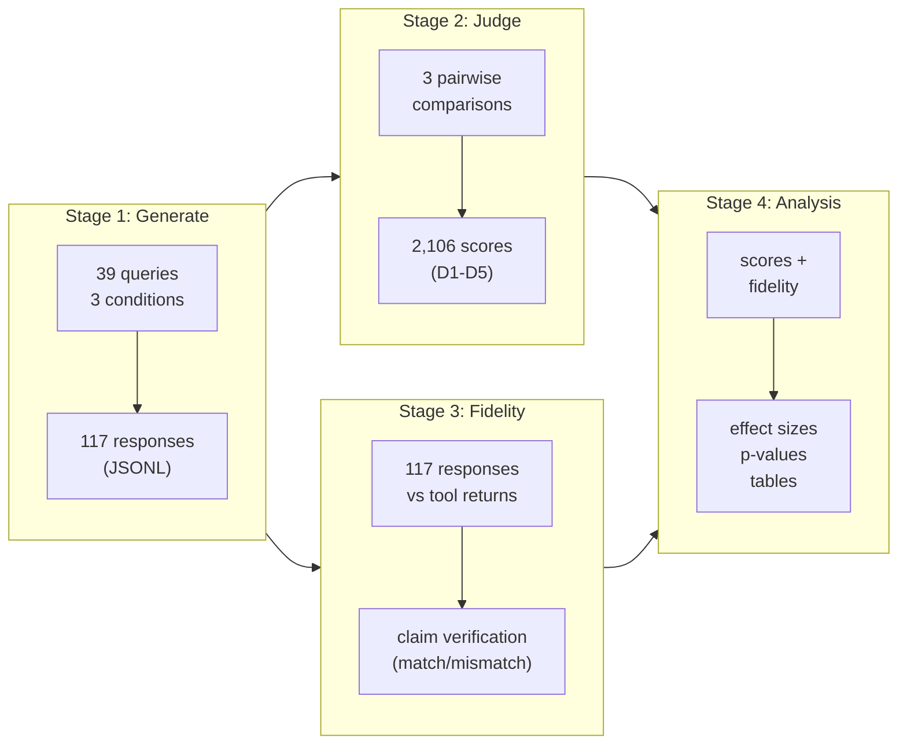
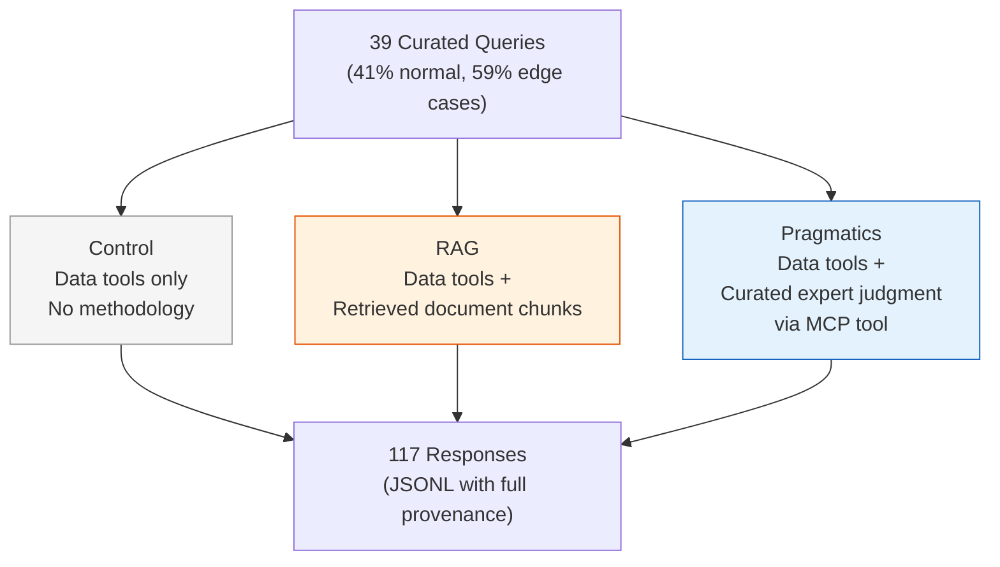
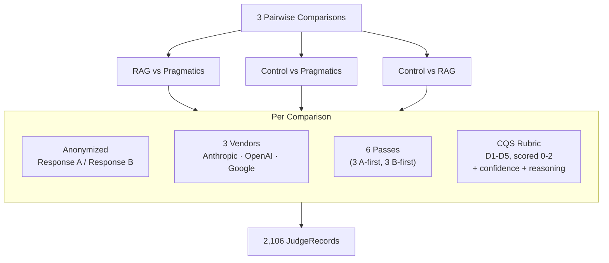
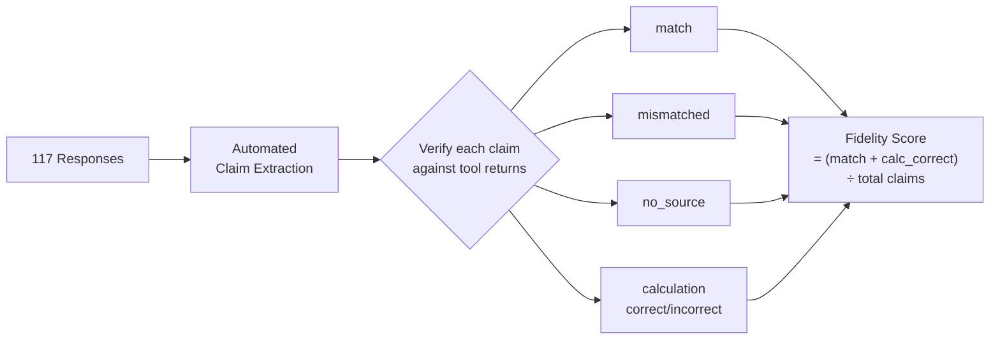
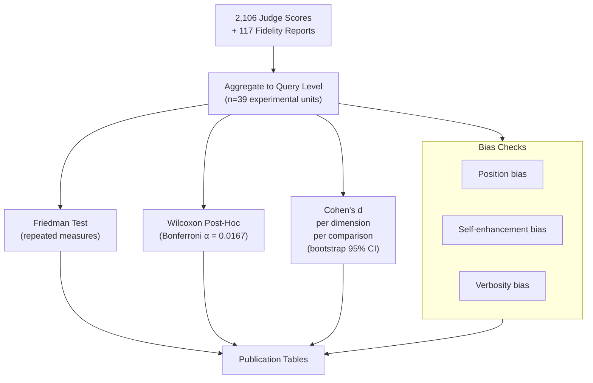

## Pipeline Overview (one slide)

**Speaker notes:** Four-stage pipeline. Stage 1 generates responses under three experimental conditions. Stage 2 scores them using a multi-vendor LLM judge panel. Stage 3 independently verifies factual claims against tool returns. Stage 4 synthesizes scores and fidelity into statistical analysis. Stages 2 and 3 run independently from Stage 1 output — they measure different things (quality judgment vs factual accuracy).

---

## Stage 1: Response Generation (one slide)

**Speaker notes:** All three conditions get the same data tools — get_census_data and explore_variables. The only variable is how methodology support is delivered. Control gets none. RAG gets methodology via standard retrieval-augmented generation — document chunks retrieved by semantic similarity, injected into the system prompt. Pragmatics gets methodology via a curated MCP tool that delivers expert judgment structured around specific statistical concepts. Same model, same queries, same API access. The question is whether the form of knowledge representation matters.

Key design decision: the production MCP server bundles pragmatics in every data response. For the experiment, we sanitize tool results — stripping the pragmatics field before the model sees it for control and RAG. The full payload is logged for fidelity verification.

---

## Stage 2: LLM-as-Judge Scoring (one slide)

**Speaker notes:** Each comparison is scored by three independent LLM vendors — this detects self-enhancement bias, where a model scores its own outputs higher. Presentation is counterbalanced: each query is scored with both A-first and B-first orderings to detect position bias. Six passes per vendor per query enables test-retest reliability measurement. The judge never sees condition labels — just anonymized Response A and Response B. Five dimensions: source selection, methodology, uncertainty communication, definitions, reproducibility. Each scored 0-2 with confidence and free-text reasoning.

Why three comparisons instead of two? Control vs each is baseline validation. RAG vs Pragmatics is the core research question — does curation outperform retrieval? That deserves direct measurement, not a derived estimate.

---

## Stage 3: Fidelity Verification (one slide)

**Speaker notes:** Stage 3 is the trustworthiness verification stage. D6 (Grounding) is a binary gate — treatment conditions ground in authoritative sources by design; control does not. Automated fidelity provides claim-level verification: every quantitative claim in the response is extracted and compared against the actual tool call data. In V2, all three conditions make tool calls, so all three get fidelity verification. RAG responses are additionally verified against retrieved chunks.

---

## Stage 4: Three-Group Analysis (one slide)

**Speaker notes:** The experimental unit is the query, not the judge record. We aggregate across vendors and passes to get one score per query per condition before running statistical tests. Friedman test is the omnibus — are the three conditions different? Then Wilcoxon signed-rank post-hoc on each pair with Bonferroni correction for three comparisons. Effect sizes reported as Cohen's d with bootstrap confidence intervals. Three bias checks run on every analysis: position bias (does A always win?), self-enhancement (does Anthropic's judge favor Anthropic's caller outputs?), and verbosity (do longer responses score higher regardless of quality?). If any bias exceeds threshold, it's flagged and reported.
