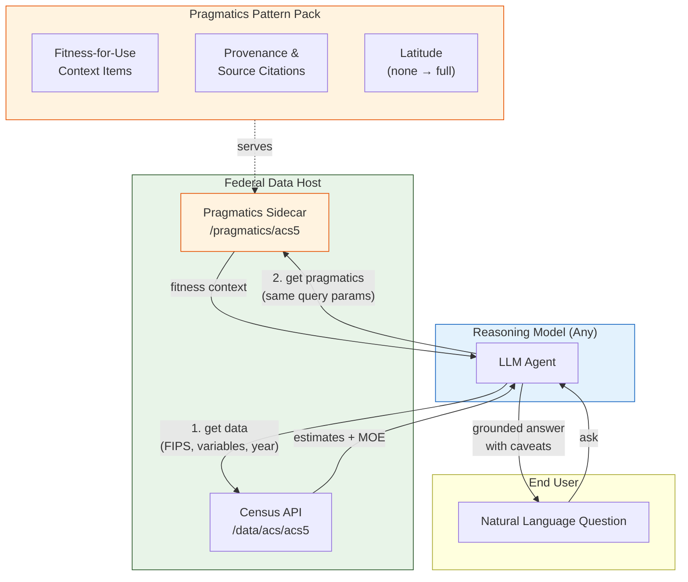

# FCSM 2026 Talk Notes

*Working notes for presentation development. Strategic/private notes maintained separately.*

## Key Themes

### The Semiotic Gap
Federal AI-ready data guidance addresses syntax (formats, APIs) and semantics (metadata, labels).
Implementation reveals a missing third layer: pragmatics — the expert judgment about fitness-for-use.

### The Semantic Layer Already Exists  
Large language models encode distributional semantics from training. The relational structure that 
formal ontology frameworks attempt to hand-build is already present in model weights. This suggests 
the productive direction is not rebuilding the semantic layer but supplying the pragmatic layer the 
model cannot learn from training data alone.

### Retrieval ≠ Understanding
A system that returns the correct number from the correct source has demonstrated retrieval accuracy.
It has not demonstrated understanding of fitness-for-use. The evaluation gap lies between "got the 
right answer" and "did what an expert would do."

## Open Questions
- How to precisely characterize what model weights encode vs. what formal ontologies provide
- Evaluation framework for pragmatic consultation quality (beyond retrieval accuracy)
- Scalability of expert-authored pragmatic content

## References
- Morris, C. W. (1938). Foundations of the Theory of Signs. University of Chicago Press.
- Census Bureau ACS documentation (census.gov)
- Xu, Y., Zhao, S., Song, J., Stewart, R., & Ermon, S. (2020). A Theory of Usable Information Under Computational Constraints. ICLR 2020. arXiv:2002.10689

---

## 2026-02-08 — Key Insight: Always-Ground Beats Sometimes-Ground

Discovered during Phase 2-3 implementation: the LLM cannot reliably assess its own confidence about domain knowledge. The pragmatics-always-accompany-data pattern (ADR-004) means one extra tool call per query is cheap insurance against confident wrongness from stale training data. This is the strongest empirical argument for the pragmatics layer — you can't trust the model to know when it doesn't know.

This directly supports the talk thesis: the semantic layer is in the weights, but the model can't distinguish "I learned this correctly in training" from "I'm confabulating plausible-sounding guidance." Pragmatics packs are the external ground truth that closes this gap.

**See also:** `reference_fcsm_ai_ready_data_landscape.md` added today — polished write-up of the practitioner's thesis, the trajectory from 2006 ML paradigm through transformers to pragmatics, and the philosophical honesty about error minimization vs. elimination.

---

## 2026-02-08 — V-Information as Formal Basis for Pragmatics Layer

Xu et al. (2020) "A Theory of Usable Information Under Computational Constraints" (ICLR 2020) provides formal grounding for three claims in this project:

1. **Always-ground is formally justified.** An LLM is a bounded observer (predictive family V). Its V-information about Census fitness-for-use from training data alone is strictly lower than when augmented with pragmatics packs. Pragmatics packs *create usable information* through preprocessing — exactly the mechanism in Section 3.2 that violates the data processing inequality. The DPI says you can't create information by computing on data; V-information says you can create *usable* information by computing on data for a bounded observer. That's what we do.

2. **Extraction is inherently lossy, and that's fine.** The asymmetry property (Section 3.3): IV(expert_knowledge → pack_thread) ≠ IV(pack_thread → expert_knowledge). We distill signal in one direction without preserving full reconstructability. We're not trying to reconstruct the expert — we're trying to ground the model.

3. **Misspecification robustness supports pragmatics-over-ontology.** Even when V is misspecified relative to the true distribution, V-information still outperforms MI estimators for structure learning (Section 6.1). You don't need a perfect knowledge representation — just one that's usable by the observer class you care about (reasoning LLMs). This is why structured pragmatics with latitude beats formal ontology.

**Not relevant:** V-information doesn't prescribe extraction methodology or support ensemble extraction strategies. It's about measurement of usable information, not about how to create the grounding content. Also not a quantum mechanics analog despite superficial resemblance to observer-dependent measurement.

---

## 2026-02-08: Phase 4A Manual Validation — Three-Model Empirical Comparison

First live test of Census MCP with pragmatics packs against the Owsley County, KY poverty query across three model tiers. All models used the same MCP tools, same pragmatics packs, no extended thinking.

**Query:** "What's the poverty rate in a small rural tract in Owsley County, Kentucky?"

### Opus 4.6
- Called `get_methodology_guidance` first (packs fired)
- Recognized tract wildcard didn't resolve, made ONE clean pivot to web search
- Identified that the tract essentially IS the county (~4,400 people)
- "County-level reliability dressed up as tract-level data" — genuine statistical insight
- "That margin of error will eat your signal alive" — consultant-grade language
- Computed CV = 14.5%, correctly classified as reasonable but misleading given geography
- No vintage mixing, no contradictory numbers

### Sonnet 4.5
- Called `get_methodology_guidance` (packs fired)
- `get_acs_data` with tract parameter returned county data — same tool bug
- Fell back to web search, then raw `curl` when pushed to use tools
- **Mixed vintages** (2019-2023 from web, 2018-2022 from API) without flagging
- Reported 24.6% then 33.3% for same tract, different years, no acknowledgment of discrepancy
- Confidently wrong — characteristic Sonnet 4.5 failure mode

### Sonnet 4
- Called `get_methodology_guidance` (packs fired)
- Made 8+ flailing tool calls trying to resolve tract geography
- Couldn't find tract FIPS codes, claimed Owsley has "one census tract" (wrong: two)
- Eventually gave up and provided county-level data
- DID correctly apply CV formula from pragmatics packs

### Key Findings

**1. Pragmatics packs grounded all three models.** Every model called `get_methodology_guidance`, used CV = SE/estimate × 100 from ACS-MOE-002, and referenced the 40% threshold. The packs work as designed.

**2. Model tier determines recovery from tool failures.** When `get_acs_data` couldn't handle tract enumeration, Opus recovered in one step, Sonnet 4.5 compensated but introduced errors, Sonnet 4 flailed. This empirically validates ADR-003's Jobs Doctrine — minimum reasoning capability is not optional.

**3. The MCP has a tract-level bug.** `get_acs_data` doesn't support tract enumeration (`tract:*`) and silently returns county data when tract codes don't resolve. Missing capability: `list_geographies` or wildcard support.

**4. Missing pragmatics content identified:**
- No proactive warning about population thresholds for tract-level analysis
- No disclosure avoidance / privacy suppression guidance (small cells)
- No "tract effectively equals county" pattern recognition
- Tool description doesn't state county is required for tract queries

**5. The 90/10 thesis holds.** LLM training data carries 90% of statistical reasoning. The packs ensure consistency and auditability. The gap is in tool capability (geography resolution) and edge-case pragmatics — exactly the 10% that needs 90% of the engineering effort.

**FCSM talk implication:** The comparison across model tiers with identical infrastructure is the empirical story. "Same packs, same tools, different reasoning" is a concrete demonstration of why ADR-003 matters.

## 2026-02-08: ADR-005 Blast Radius — Integration Test Breakage

When ADR-005 rewrote `server.py` from FastMCP to low-level pattern, the integration tests in `tests/integration/test_mcp_server.py` were not updated. They imported `ServerContext` and `get_server_context` — constructs that no longer exist. Tests failed with `ImportError` on first run after bug fixes.

**Root cause:** ADR-005 changed the public interface of `server.py` but the blast radius wasn't traced. The tests were a downstream dependency that nobody checked.

**Fix:** Rewrote tests to match low-level pattern:
- Removed `ServerContext` / `get_server_context` imports
- Tests now patch module globals (`_loader`, `_retriever`, `_census_client`) directly
- Tool calls go through the real `call_tool_handler` dispatcher
- Added `_call_tool()` helper for clean JSON round-trip
- Added new tests for ADR-006 fixes (tract+county, tract-without-county, wildcard)

**Changes:**
- Old: 6 tests, 2 import FastMCP constructs, call `census_tools.*` directly
- New: 8 tests, patch module globals, call through dispatcher
- Net new tests: `test_get_acs_data_tract_requires_county`, `test_get_acs_data_tract_with_county_works`, `test_get_acs_data_tract_wildcard`

**Trace system lesson:** This is exactly the kind of dependency the trace MCP should catch. If `server.py` had been registered as an artifact with `tests/integration/test_mcp_server.py` as a downstream `verifies` dependency, `trace:check_impact` would have flagged the tests before the ADR-005 rewrite shipped. Filing this as a concrete use case for when trace is integrated into the Census MCP workflow.

## 2026-02-08: G.6 Prompt Slimming — Tool Rename and FSS-General Language

**What changed:**
- Agent prompt: 280 → 55 lines. Domain-specific rules removed (packs cover them).
- "Never" list: 7 → 4 items (all behavioral, no domain knowledge).
- "Always" list: 5 → 4 items. Added "communicate uncertainty proportional to context."
- Added audience calibration line.
- Removed all ACS/survey-specific language from prompt. Now says "federal statistical system."
- Renamed tool `get_acs_data` → `get_census_data` (server accepts both for backward compat).
- Design notes separated from prompt into `agent_prompt_design_notes.md`.

**Principle:** Prompt = how to think. Packs = what to know. Naming specific surveys in the prompt is overfitting.

**External validation:** ChatGPT 5.2 SWOT analysis of the slim prompt identified audience calibration gap (adopted) and uncertainty communication gap (adopted). Also suggested causal inference guardrail and dual-output templating (rejected — wrong scope for descriptive survey system).

**FCSM talk implication:** The separation of epistemic discipline (prompt) from domain knowledge (packs) is a design principle worth presenting. The prompt doesn't know what survey it's working with — packs specialize at runtime. This enables cross-survey architecture where the same reasoning discipline works for ACS, CPS, SIPP, or any FSS product.

**Test impact:** Integration tests updated to new tool name. 10 tests total (was 9). Added legacy compatibility test.

## 2026-02-09: Quarry Database Setup, First Extraction, and Pipeline Pivot

### What Happened
Full end-to-end test of the KG extraction pipeline using neo4j-labs/llm-graph-builder against the CPS Handbook of Methods (22 pages).

**Environment setup (3 hours):**
- llm-graph-builder cloned, Python 3.12 venv configured
- torch CPU suffix broke on macOS ARM64 (sed fix for constraints.txt)
- RAGAS module has hard OpenAI import dependency — requires dummy API key even with local embeddings
- Backend started at localhost:8000 via uvicorn

**Schema API discovery (dead end):**
- Context7 docs suggested POST /schema to set extraction schema. Wrong.
- Code inspection revealed /schema is read-only (queries existing labels)
- Frontend-dependent schema configuration (Graph Enhancement tab → Data Importer JSON) — requires React app
- Pivoted to direct Cypher seeding via Python script

**Layer 0 seeding (success):**
- 21 nodes: 5 AnalysisTask, 5 QualityAttribute, 4 DataProduct, 6 SurveyProcess, 6 CanonicalConcept + 1 SourceDocument placeholder
- 5 REQUIRES edges with rule_type, threshold, violation_template, recommended_action
- 5 constraints, 8 indexes

**Layer 1 extraction (mixed):**
- 291 nodes, 349 relationships from 22-page PDF
- 93 MethodologicalChoice, 36 ConceptDefinition, 22 TemporalEvent, 17 Threshold
- BUT: Only 3 PRODUCES edges (critical harvest join path nearly empty)
- 291 MENTIONS (generic fallback — noise)
- 9 SourceDocument nodes from 1 PDF (entity hallucination)
- Page-based chunking (1 page = 1 chunk) — lost section context

**Enrichment pass (success):**
- Direct LLM prompt: "What quality consequence does this MethodologicalChoice produce?"
- 89/93 choices got PRODUCES edges with typed QualityAttribute properties
- All 5 REQUIRES dimensions now have matching observations
- 96% coverage from a simple, well-prompted LLM call — outperformed LLMGraphTransformer

**First harvest (partially successful):**
- 8 numeric threshold results: 1 genuine (75% rotation overlap), 7 false positives (type mismatch)
- 20 interaction candidates: some useful (rotation × population controls), some noise (cartesian products)
- Cross-survey queries: 0 results (expected — single survey in document)
- Only 4 orphaned MethodologicalChoice nodes — good coverage

### Key Decisions
- **ADR-008:** Replace llm-graph-builder with custom pipeline. LLMGraphTransformer doesn't populate typed properties, requires enrichment cleanup, page-based chunking is inadequate.
- **ADR-009:** Ship quarry toolkit as project component. Extraction pipeline = reproducible methodology for FCSM paper + toolkit for domain experts.

### Lessons Learned
1. **Direct LLM extraction > LLMGraphTransformer.** The enrichment script (structured JSON output, controlled vocabulary prompt) produced better results in one pass than extraction + enrichment combined.
2. **Section-aware chunking is mandatory.** Page boundaries split mid-paragraph, mid-table. Methodology docs have clear structure (numbered sections, headers). Use it.
3. **Entity resolution at write time prevents hallucinated duplicates.** MERGE on canonical names, not LLM-generated names.
4. **Harvest query false positives come from missing type constraints.** Need `WHERE qa_obs.value_type = qa_std.value_type` to prevent comparing PSU counts against overlap fractions.
5. **Neo4j MCP is single-database.** Claude Desktop config allows one NEO4J_DATABASE. Multi-database work requires direct Python scripts.
6. **llm-graph-builder is a demo tool, not a production extraction pipeline.** Good for pretty graph pictures. Not for domain-specific structured knowledge engineering.

### The Genuine Finding
CPS rotation group design creates 75% sample overlap in consecutive months. The harvest correctly identified this exceeds the 0.2 threshold for temporal comparability. This is exactly the kind of warning a senior statistician would give — and it was derived by graph pattern-matching, not extracted directly from the document. **The architecture works. The tooling doesn't.**

### Files Created
- `docs/decisions/ADR-008-custom-extraction-pipeline.md`
- `docs/decisions/ADR-009-quarry-toolkit-shippable.md`
- `docs/lessons_learned/session_2026-02-09_quarry_setup.md`
- `~/Documents/GitHub/llm-graph-builder/extract_to_quarry.py` (test script)
- `~/Documents/GitHub/llm-graph-builder/enrich_quarry.py` (enrichment script)
- `~/Documents/GitHub/llm-graph-builder/harvest_quarry_v2.py` (harvest script)

---

### 2026-02-09 (Session 2): Quarry Archive & Pipeline Pivot to Docling

**Quarry baseline snapshot before wipe** (llm-graph-builder extraction, CPS Handbook 22 pages):
- 401 nodes: 112 QualityAttribute, 93 MethodologicalChoice, 35 ConceptDefinition, 32 DataProduct, 22 Document, 22 TemporalEvent, 19 SurveyProcess, 17 Threshold, 16 QualityCaveat, 11 SourceDocument, 9 UniverseDefinition, 8 CanonicalConcept, 5 AnalysisTask
- 745 relationships: 291 MENTIONS (noise fallback), 110 SOURCED_FROM, 107 PRODUCES (104 from enrichment pass, 3 from extraction), 54 APPLIES_TO, 37 PART_OF, 35 DEFINED_FOR, 32 OPERATIONALIZES, 17 CONSTRAINS, 16 QUALIFIES, 15 IMPLEMENTS, 15 SUPERSEDES, 10 TARGETS, 5 REQUIRES (Layer 0 seed), 1 MITIGATES

**Known quality issues in baseline:**
1. 291 MENTIONS relationships = LLMGraphTransformer fallback when it can't match schema. Pure noise.
2. 11 SourceDocument nodes from 1 PDF — entity resolution failure ("CPS Handbook of Methods", "Handbook of Methods", "CPS Technical Documentation", etc.)
3. 32 DataProduct nodes — should be ~4 (CPS Basic Monthly, CPS ASEC, etc.). Explosion from uncontrolled entity creation.
4. Harvest false positives: `mode_change_year=1994` compared against `threshold_number=0.2` because no `value_type` filtering. `psu_count=1987` and `sample_size=60000` matching precision thresholds meant for different measures.
5. Only genuine finding: `rotation_group_overlap=0.75` exceeding `temporal_comparability` threshold of `0.2` for EstimateChangeOverTime task. Schema architecture validated despite tooling failure.

**Decision: Docling for PDF parsing** (replaces PyMuPDF page-based extraction)
- IBM Research / LF AI Foundation, MIT license, 8K+ GitHub stars
- Built-in `HierarchicalChunker` respects section boundaries (our #1 failure mode solved)
- Table structure detection with multi-level headers → DataFrame export
- Local execution, Apple Silicon MLX acceleration
- Unified DoclingDocument (Pydantic) with layout metadata, reading order, provenance
- Risk: "computationally intensive" per docs, but irrelevant for 3-4 documents

**Dual Neo4j MCP configuration confirmed:**
- `neo4j-pragmatics` → pragmatics database (25 Context, 1 Pack)
- `neo4j-quarry` → quarry database (to be wiped and rebuilt)
- Resolves previous single-database MCP limitation

**Pipeline design: `scripts/quarry/`** — Docling for parsing, direct structured JSON extraction via LLM, MERGE-based entity resolution, single-pass with OHIO dedup (second pass if needed).

**Target documents for March talk:**
1. CPS Handbook of Methods (22 pages — baseline comparison)
2. ACS Design & Methodology 2024 (100+ pages)
3. CPS Tech Paper 77 (180 pages — scale test)
4. TBD: Census geography hierarchy or statistical quality standards

---

## 2026-02-09 — Extraction Pipeline Results: CPS Handbook, ACS D&M, TP-77

### CPS Handbook (22 pages) — Sonnet
- 157 chunks, 465 nodes, 73 relationships created
- $1.75, ~15 min sequential, ~5.5 min with 3 workers
- 0 validation errors (after evolutionary vocabulary fix)
- 0 MENTIONS, 1 SourceDocument (both pass)
- Baseline comparison vs llm-graph-builder: every failure mode resolved (see ADR-008)

### ACS Design & Methodology 2024 (~150 pages) — Sonnet
- 1347 chunks, 4278 nodes, 741 relationships
- $16.87, ~31 min with 3 workers
- 2 validation errors (0.15% error rate)
- Cross-document harvest working: 3 temporal breaks detected

### CPS Technical Paper 77 (~180 pages) — Haiku ❌
- 1531 chunks, 5077 nodes created (but unreliable)
- **25.7% chunk failure rate** — 394/1531 chunks lost to JSON parse errors
- 5.98% validation error rate (above 5% threshold)
- Haiku hallucinated node and relationship types not in the schema
- $7.23 — cheaper per-dollar but wasteful given 25.7% data loss
- **Verdict: Haiku is not suitable for structured JSON extraction with strict schema compliance.** Haiku works for classification and simple tasks, but cannot reliably produce valid JSON conforming to a controlled vocabulary with 12 node types and 16 relationship types. The cost savings evaporate when a quarter of chunks fail.
- TP-77 must be re-extracted with Sonnet.

### Harvest Results (CPS + ACS, pre-TP77 reextract)
- 0 numeric threshold violations (value_type filter working)
- 0 categorical mismatches (only one survey pair so far)
- 3 temporal breaks (ACS continuous collection 2005, military service question 2024)
- 40 unanticipated interactions (medium confidence, structurally connected via shared QualityAttribute)
- 50 unconnected facts (MethodologicalChoices with no PRODUCES edges — expected for single-survey extraction)
- 0 MENTIONS (pass)

### Key Decisions Made Today
- **ADR-010: Evolutionary Vocabulary** — Three-tier controlled vocab (core/provisional/rejected). LLM found `dissemination` as legitimate category we missed. `definition` was node-type error, not vocab gap. Requirement FR-QE-014.
- **`scope` property added to QualityAttribute** — Distinguishes national/state/sub_state/subgroup/unit measurement level. Eliminates false positives where national sample size (60K) matched per-area threshold (100). Combined with `value_type` filter for belt-and-suspenders.
- **Harvest interaction query fixed** — Was doing cartesian join on dimension (n² noise). Fixed to require shared QualityAttribute node via PRODUCES. Went from 50 low-confidence to 40 medium-confidence structurally-connected results.
- **Parallel workers** — `--workers N` (1-5) via ThreadPoolExecutor. 3x speedup on CPS (18 min → 5.5 min).

### Model Selection Lesson
The "Jobs Doctrine" applies to model selection too, but in the opposite direction from what you'd expect. Smaller/cheaper models don't always clear out complexity — sometimes they introduce it. Haiku's 25.7% failure rate on structured extraction means you'd need error handling, retry logic, output repair, and validation complexity that doesn't exist with Sonnet's <1% failure rate. The cheapest model is the one that works the first time.

Exception: when the task is genuinely simple (classification, yes/no, short-answer), smaller models are appropriate. The discriminator is output structure complexity, not task conceptual difficulty.

### Cost Summary
| Document | Model | Chunks | Cost | Failure Rate |
|----------|-------|--------|------|--------------|
| CPS Handbook | Sonnet | 157 | $1.75 | 0% |
| ACS D&M | Sonnet | 1347 | $16.87 | 0.15% |
| TP-77 | Haiku | 1531 | $7.23 | 25.7% |
| TP-77 (redo) | Sonnet | 1531 | ~$19 | <1% |
| Quality Standards | Sonnet batch-3 | 2476 | $10.02 | <2% (post-cleanup) |
| ACS General Handbook | Sonnet batch-2 | 1326 | $5.89 | <2% (post-cleanup) |

Total extraction spend: ~$55. Budget holding.
Batch mode savings: ~$10-15 vs single-chunk.

### Final Quarry State (5 documents)
- 13,227 nodes, 100% schema compliant (12 types)
- 5 SourceDocuments: CPS Handbook, ACS D&M, CPS TP-77, Quality Standards, ACS General Handbook
- 10 threshold violations, 34 temporal breaks, 147 unanticipated interactions
- Post-extraction cleanup required for Quality Standards and ACS Handbook (~12% invalid types from confabulated node labels, reclassified or deleted)

### Terminology: Confabulation, Not Hallucination
"Hallucination" implies sensory/perceptual phenomenon — models perceiving something that isn't there. LLMs don't perceive anything. They do statistical pattern-completion and generate plausible outputs that aren't grounded in fact.

"Confabulation" is the precise term from neuropsychology — filling in gaps with fabricated information without awareness of doing so. Mechanistically closer to what's actually happening: the model has incomplete information and pattern-completes confidently, producing outputs that look right but aren't sourced.

For a project built on auditable provenance and source-grounded expert judgment, the distinction matters. The entire pragmatics layer exists because LLMs confabulate — they produce statistically plausible Census guidance that isn't traceable to any methodology document. "Hallucination" obscures the mechanism. "Confabulation" points directly at the failure mode the architecture is designed to prevent.

*Potential FCSM talking point — probably only lands with the few nerds who care about precision. Which is exactly the audience.*

---

## 2026-02-10: Harvest Curation — First Batch Complete

### Temporal Comparability Curation Results
34 harvest candidates from quarry → 13 curated pragmatic items (11 CPS, 2 ACS additions).

Consolidation was mostly deduplication: the quarry extracted the same methodological event from multiple quality attribute angles (e.g., 6 nodes for the CPS rotation group design representing month-to-month overlap, year-to-year overlap, overlap rate, etc. — all one pragmatic item). The 2000 population control event was duplicated across two TemporalEvent nodes pointing at the same MethodologicalChoice. This is expected behavior from chunk-level extraction without entity resolution.

New staging directory: `staging/cps/` for CPS-domain pragmatics.

### Provenance Gap: Missing Page Numbers
**Known limitation:** The quarry's SOURCED_FROM edges lack page-level provenance. The extraction pipeline captures `source_page` as a property on the SOURCED_FROM relationship, but the LLM extraction didn't reliably populate it. Section names in the curated items are approximate reconstructions from node IDs and context, not direct extractions.

**Impact:** Curated items have document-level provenance (which source doc) but not page-level (where in the doc). This weakens auditability — someone verifying a pragmatic item has to search the full document rather than turning to a specific page.

**Fix options (future):**
1. Extraction prompt engineering: explicitly require page numbers in structured output
2. Post-extraction enrichment: use chunk metadata (if Docling preserves page boundaries) to backfill page numbers on SOURCED_FROM edges
3. Manual spot-check: for high-value items (latitude=none), manually verify and add page numbers

For FCSM evaluation, document-level provenance is sufficient. Page-level is a quality improvement for production.

### Latitude Distribution
- `none`: 2 items (1994 redesign, 2003 race question) — hard breaks, no wiggle room
- `narrow`: 7 items — strong guidance with rare exceptions
- `wide`: 2 items (LAUS 2004, sample frame redraws) — background context
- This distribution feels right: most temporal breaks ARE narrow-latitude because they're documented discontinuities with known boundaries.

---

## 2026-02-10: Confidence-Gap-Driven Curation — Second Batch

### Harvest Exhaustion Analysis
All existing harvest queries fully mined:

| Harvest Category | Candidates | Curated Items | Notes |
|---|---|---|---|
| Temporal breaks | 34 | 13 | Done ✅ |
| Threshold violations | 10 | 0 | Already covered by CPS-BRK-001 |
| Unanticipated interactions | 147 | 0 | All noise — structural connections, not confounding |
| Unconnected facts | 50 | not harvested | Need new queries |
| Coverage/nonresponse/precision | untapped | — | Need new harvest approach |

The interaction query (§6.4) is architecturally sound but produces false positives because "two methodology choices affect the same quality dimension" is taxonomy, not confounding. Real interactions require domain expert authoring.

### Confidence Gap Analysis
Asked: "What am I least confident about as a Census statistical consultant?" Identified 5 gaps in current packs:
1. **CPS methodology** — zero CPS guidance before this session
2. **Nonresponse bias / imputation** — ACS mentions noise injection but no allocation rate guidance
3. **ACS weighting/imputation** — no hot-deck or B99 table guidance
4. **Cross-survey comparability** — ACS vs CPS definitional differences undocumented
5. **Group quarters** — ACS includes, CPS excludes; affects college towns, military, prisons

Quarry confirmed source material exists for all 5 gaps (nodes from ACS D&M 2024 and CPS docs). Most quarry nodes on these topics lack PRODUCES edges — they're unconnected facts from the extraction. Authored pragmatics directly using quarry as confirmation of source coverage.

### Second Batch Results (9 items)

**ACS nonresponse (2 items):**
- ACS-NRS-001: Allocation rates as quality signal (>30% = caution)
- ACS-NRS-002: Hot-deck imputation and B99 tables

**ACS group quarters (2 items):**
- ACS-GQ-001: ACS includes GQ, CPS doesn't — divergence for college/military/prison areas
- ACS-GQ-002: GQ imputation rates (30-50% wholly imputed)

**CPS cross-survey (3 items):**
- CPS-XSV-001: Universe differences (civilian noninst 16+ vs total pop)
- CPS-XSV-002: Reference period differences (specific week vs rolling)
- CPS-XSV-003: Income reference period (ASEC calendar year vs ACS past-12-months)

**CPS sampling (2 items):**
- CPS-SAM-001: ~60K households, national/state reliable, not for small-area
- CPS-SAM-002: Complex survey design — SRS standard errors understate true error

### Running Totals
- **ACS pack:** 25 existing + 2 break + 2 nonresponse + 2 GQ = 31 items
- **CPS pack:** 11 break + 3 cross-survey + 2 sampling = 16 items
- **Total staged:** 47 items across 2 domains

---

## 2026-02-10: FCSM Thesis Crystallized

### Core Thesis

**Pragmatics is the missing layer that makes federal and open statistical data AI-ready.**

Statistical data APIs currently ship estimates and margins of error. They do not ship the expert judgment required to *use* those numbers correctly. When LLMs consume this data on behalf of users, they confabulate fitness-for-use guidance from training data — plausible-sounding but unauditable, sometimes wrong, and untraceable to any methodology document.

The fix is simple in concept: **ship pragmatics with the data.** Either the API host includes fitness-for-use context in the payload (best case), or a local system intercepts and enriches the response before it reaches the reasoning model. The local system needs nothing more than a search string back to the host — not a complicated architecture.

### Two delivery models

**Host-side (ideal):** Census API returns `{estimate, moe, pragmatics: [...]}`. The data producer knows the caveats better than any downstream consumer ever will. "This estimate has a CV of 47% because the sample in this tract is 38 households" is something only the Bureau can say authoritatively. Shipping data without pragmatics is shipping medication without prescribing information — technically complete, practically dangerous.

**Client-side (current proof of concept):** The Census MCP server intercepts queries, retrieves data from the API, and bundles locally-curated pragmatics into the response. This works but is inherently second-best — it requires independent maintenance of expert judgment that the data producer already possesses.

### What we actually built (architectural framing)

Not novel components. Novel *composition* of existing patterns:

- **RAG** — but the retrieval corpus is curated expert judgment, not raw documentation. Raw-document RAG fails in Census because the domain is too semantically homogeneous for embeddings to differentiate ("semantic smearing").
- **Knowledge graph** — but as authoring scaffolding, not runtime infrastructure. GraphRAG assumes you need graph traversal at query time. You don't. You need it at *curation* time to find patterns and ensure coverage. Then you ship a flat pack. The graph is scaffolding, not load-bearing structure.
- **MCP** — the protocol that makes tool-mediated data retrieval + pragmatics bundling tractable for any reasoning model.

The contribution isn't the patterns — it's the *recognition* that statistical data has a pragmatics problem, not a search problem, and the architecture that follows from that diagnosis.

### The grounding distinction

| Approach | Grounded in | Failure mode |
|----------|------------|-------------|
| Standard RAG | Source documents (chunks) | Semantic smearing in homogeneous domains |
| GraphRAG | Document-derived graph structure | Runtime overhead, community summarization costs |
| This system | Curated expert judgment with provenance | Curation bottleneck (human-in-the-loop) |

We don't ground in documents. We ground in *context-aware expertise* that's triggered by the questions and concepts near the decision edge. The retrieval store isn't "what the handbook says" — it's "what a senior statistician would tell you after reading the handbook."

### The provocation for FCSM

Statistical data APIs have a duty to ship pragmatics alongside estimates. MCP (or any tool-use protocol) makes it tractable. The Census MCP server is a proof of concept for what the Bureau itself should be doing.

The alternative — every downstream LLM application independently reconstructing fitness-for-use judgment from training data — is a confabulation engine at scale. A thousand chatbots each independently guessing what "margin of error" means for a tract-level poverty estimate. The data producer can stop this by shipping the answer.

### Terminology note (for the 3 FCSM attendees who care)

**Confabulation**, not hallucination. Hallucination implies perception of nonexistent stimuli — LLMs don't perceive anything. Confabulation (from neuropsychology) is filling gaps with fabricated information without awareness of doing so. Mechanistically closer to what's happening: the model has incomplete information and pattern-completes confidently. The entire pragmatics layer exists because LLMs confabulate statistical guidance. Using the precise term points directly at the failure mode the architecture prevents.

### Empirical Evidence: Why Embedding-Based RAG Fails in Statistical Domains

Two separate bodies of evidence, both pointing to the same problem:

**Evidence 1: Survey question semantic homogeneity (measured).** From the Federal Survey Concept Mapper project (Webb, 2025): RoBERTa-large pairwise similarity across 6,987 federal survey questions yielded mean 0.9916 with effectively zero SD. Concept-matching against 157 Census taxonomy concepts produced a perfectly flat distribution — 0.64% per concept (exactly 1/157, random chance). Adding survey context made zero difference. Root cause: information asymmetry between 100-word detailed questions and 2-word concept labels. Embeddings can't bridge that gap through similarity — it requires *reasoning*. Source: `federal-survey-concept-mapper/docs/project/lessons_learned_embedding_failure.md`, report Section 10.2.1.

**Evidence 2: ACS variable metadata semantic smearing (measured, 2026-02-10).** Matched-pairs analysis of 2,500 ACS 5-year variables (seed=20260210), comparing raw Census metadata (label + concept, ~166 chars) against LLM-enriched metadata (~6,358 chars per variable). Two embedding models: MiniLM-L6-v2 (384d) and RoBERTa-large (1024d).

> **🎬 SLIDE MATERIAL** — Core results table.

| Metric | Raw (label+concept) | Enriched (full text) | Change |
|--------|-------------------|---------------------|--------|
| Mean pairwise similarity (RoBERTa) | 0.4199 | 0.7651 | **+82%** |
| Within-group similarity | 0.6331 | 0.8199 | +30% |
| Cross-group similarity | 0.3996 | 0.7599 | **+90%** |
| Group discrimination (Δ) | 0.2334 (58.4%) | 0.0600 (7.9%) | **−86.5% collapse** |
| Cohen's d (paired t-test) | — | 4.85 | massive effect |
| Paired t-test | — | t=180.2, p<0.001 | — |
| Wilcoxon signed-rank (nonparametric) | — | p<0.001 | confirms t-test |

**The smoking gun: asymmetric homogenization.** Cross-group similarity (unrelated variables) increased 90% under enrichment while within-group similarity (related variables) increased only 30%. The enrichment text is more similar across unrelated variables than the distinguishing content is within related ones. This asymmetry is the mechanism proof — boilerplate dominates the embedding space.

**Larger models amplify the effect:**

| Metric | MiniLM (384d) | RoBERTa (1024d) |
|--------|--------------|------------------|
| Raw mean similarity | 0.4297 | 0.4199 |
| Enriched mean similarity | 0.6271 | 0.7651 |
| Enrichment increase | +46% | +82% |
| Discrimination collapse | 63.7% | 86.5% |

RoBERTa-large is MORE sensitive to semantic smearing, not less. The larger model is better at encoding the shared methodology content that causes smearing. This eliminates the "use a better model" objection.

**Income variable example:** B19131_012E (family type income) vs B25122_081E (housing costs by income) — raw similarity 0.69 (related but distinguishable), enriched similarity **0.96** (approaching the 0.9916 survey question failure baseline). An income variable and a housing variable became virtually identical in embedding space.

**Trajectory toward failure mode:**
```
Raw ACS (0.42) -----> Enriched ACS (0.77) -----> Survey Questions (0.99)
   Good retrieval        Poor retrieval            Failed retrieval

Enrichment moved ACS variables 60% toward the survey question failure baseline.
```

Source: `talks/fcsm_2026/analysis/semantic_smearing_report.md`, full reproducibility artifacts in `talks/fcsm_2026/analysis/results/`.

**Both corpora confirmed.** Survey questions (0.9916) and enriched variable metadata (0.7651) both exhibit severe semantic homogeneity from the same root cause — standardized statistical language from a single agency about a narrow domain. The concept mapper proved it for questions; the variable metadata analysis now confirms it for outputs.

**Why this matters for the pragmatics thesis:** Embedding-based RAG fails on BOTH the instruments (questions) and the outputs (variables). The entire traditional RAG approach is structurally unsuited to Census data. The pragmatics architecture sidesteps this by not using embeddings at all — retrieval is tag-matching on curated triggers, not cosine similarity over dense vectors.

### The Real Architectural Insight: RAG Was Solving the Wrong Problem

The v1/v2 Census MCP server spent enormous effort on variable discovery via RAG: 1GB enriched metadata, FAISS indexes, concept mappings, dual-path search. The assumption was that the hard problem was *finding* the right Census variables given a natural language question.

That assumption was wrong. **The LLM already knows how to find variables.**

Look at raw Census API metadata:
- `B19001B_014E` → label: "Estimate!!Total:!!$100,000 to $124,999", concept: "Household Income... (Black or African American Alone Householder)"
- `B19001B_013E` → label: "Estimate!!Total:!!$75,000 to $99,999", same concept

The naming convention IS the semantic layer. B19 = income tables. The suffix is the bin position. The concept field describes the universe. A reasoning LLM can parse this structure and construct the correct API call from a user question like "income distribution for Black households" — no embeddings needed, no enrichment needed.

The enrichment made things worse. Each variable got a ~6,000-character domain specialist essay that was ~95% identical boilerplate ("The ACS is a continuous survey... self-reported... sampling error... consult MOE..."). The distinguishing content — which specific variable, which universe, which occupation — was 50 words buried in 6,000 words of shared methodology. The enrichment *homogenized* the embedding space by amplifying shared context over distinguishing features. It was a confabulation amplifier for retrieval.

**What the MCP actually needs to do:**

> **🎬 SLIDE MATERIAL** — This table is a candidate slide. Six rows. Left column = task, right = why the LLM can or can't do it. Audience sees immediately that variable discovery is the easy part, fitness-for-use is the hard part, and that's exactly what's missing from every data API today.

| Task | Who should do it | Why |
|------|-----------------|-----|
| Variable discovery | LLM (reasoning) | Can parse naming conventions, table structure, concept fields |
| API call construction | LLM + MCP validation | LLM builds query, MCP validates FIPS codes and variable existence |
| Fitness-for-use judgment | Pragmatics layer | LLM CANNOT do this from training data — requires curated expert knowledge |
| MOE interpretation | Pragmatics layer | Domain-specific thresholds, not generic statistics |
| Temporal comparability | Pragmatics layer | Vintage-specific rules the LLM has no way to know |
| Geographic pitfalls | Pragmatics layer | St. Louis independent city status, PUMA changes, etc. |

The LLM handles variable discovery through reasoning. The MCP's job is everything the LLM *can't* do from training data: live API execution, and shipping the expert judgment (pragmatics) that makes the data interpretable.

**This reframes the entire architecture.** It's not "RAG failed so we pivoted to pragmatics." It's "RAG was solving the wrong problem." The hard problem was never finding variables — it was knowing what to say about them once you found them. Pragmatics IS the product. Variable discovery is a solved problem that the LLM handles natively.

**Evidence trail:**
- Survey question semantic smearing: 0.9916 mean pairwise similarity (measured, RoBERTa-large, 6,987 questions)
- Variable metadata semantic smearing: 0.7651 enriched vs 0.4199 raw mean similarity, 86.5% discrimination collapse (measured, RoBERTa-large, n=2,500, seed=20260210)
- Cross-model validation: MiniLM-384 confirms same pattern; larger model amplifies effect (+82% vs +46%)
- Asymmetric homogenization: cross-group similarity +90%, within-group only +30% — mechanism identified
- Income-housing pair at 0.96 enriched similarity (approaching 0.9916 failure baseline)
- v1/v2 MCP operational experience: RAG retrieval unreliable despite 1GB enriched index (observed, now explained)
- v3 MCP: LLM handles variable discovery natively, MCP provides pragmatics + API execution (working)
- Full analysis: `talks/fcsm_2026/analysis/semantic_smearing_report.md`

### Framing for federal audience

"Not novel, not new — just using design patterns better" is the right tone for FCSM. Novel gets skepticism from federal statisticians. "We composed existing patterns in a way that actually works for statistical data dissemination" is more credible than "we invented a thing." The audience wants to know: does this solve a real problem, and can we do it too? Answer to both: yes, and it's not that hard — the hard part is curating the pragmatics, which is work statisticians already do informally every time they advise a data user.

---

## 2026-02-10: Sidecar Delivery Model & PPP Operationalization

### Delivery Tiers (Future ConOps)

Three realistic adoption paths, in order of integration depth:

1. **Embedded (ideal, long-term):** Host API returns `{data, pragmatics}` in a single payload. Requires the data producer to adopt the pattern. Highest quality — they know the caveats best.

2. **Sidecar (realistic near-term):** Separate pragmatics endpoint, same query parameters as the data API. LLM makes two calls: one for data, one for fitness-for-use context. Can be maintained independently — by the Bureau, by a third party, by the research community. Could be as simple as a static file server keyed by product/geography-level/variable-group. A CDN could serve it.

3. **Local (current proof of concept):** SQLite packs bundled with the MCP server. Works offline, zero external dependencies, but stale the moment methodology updates.

**Key insight:** The pragmatics content is delivery-agnostic. The same curated expert judgment items work whether embedded, sidecar-served, or locally bundled. The curation pipeline (quarry → harvest → curate → pack) produces content that's independent of delivery mechanism. The contribution is the content and its structure, not the plumbing.

### OV-0: Sidecar Architecture (Future State)



The sidecar accepts the same query parameters as the data API — product, geography, variables, year. No new query language. No complex integration. Just "give me the pragmatics for the data I just pulled." The pragmatics endpoint is backed by a Pragmatics Pattern Pack (PPP) — the same curated content structure whether served from a CDN, a database, or a local file.

### Operationalizing PPPs: The Bootstrap Loop

The objection to any "expert knowledge" system is always: "Who's going to spend 3 years in committee writing all this?" Nobody. That's why most knowledge engineering projects die.

The operationalization path:

**Phase 1 — Manual seed (done).** A domain expert writes 25-50 pragmatics items by hand. This takes hours, not months. These are the things a senior statistician says every time someone asks about the data. They already know them — they just haven't written them down in a structured format.

**Phase 2 — Quarry extraction (done).** Run methodology documents through an LLM extraction pipeline. 238 pages → 13K nodes → harvest queries → candidate pragmatics. The quarry doesn't replace expert curation — it tells you *what to curate*. It surfaces patterns the expert might miss or forget.

**Phase 3 — LLM-assisted expansion (next).** With a manually-curated seed set as exemplars, use LLM power to extract candidate PPP items from the quarry at scale. The seed set IS the few-shot prompt — "here are 25 good pragmatics items, find more like these in the knowledge graph." Claude Code or batch API can process the full quarry against the pattern. Expert reviews and approves — doesn't write from scratch.

**Phase 4 — Empirical distillation.** With a larger authoritative set (100+ items), run the test bench. Which items actually change LLM behavior? Which ones fire but don't improve response quality? Which combinations create the best consultation quality scores? Distill the PPP to the items that empirically matter. The PPP gets *smaller and sharper* over time, not bigger and fuzzier.

**Phase 5 — Community contribution.** Publish the PPP schema and authoring guide. Domain experts at other agencies author their own PPPs for their surveys (BLS for CPS employment, NCHS for NHIS, etc.). The sidecar pattern means each agency maintains their own pragmatics. No central committee. No 3-year process. Each agency knows their caveats — they just need the format to ship them.

### Why this isn't ivory tower

- The seed set took hours, not years
- The extraction pipeline cost $55 for 5 documents
- The curation step is "read 34 candidates, write 15 items" — an afternoon
- The PPP schema is 8 fields (id, domain, category, latitude, context_text, triggers, thread_edges, provenance)
- The delivery mechanism is a search string, not a graph database
- The test bench validates empirically, not by committee consensus

Every step is something one person can do in a week. The entire pipeline from "I have methodology PDFs" to "I have a shippable pragmatics pack" is a month of part-time work. That's the operationalization story for FCSM: not "here's a theoretical framework" but "here's what we built, here's what it cost, here's the evidence it works, and you can do it too."

---

## 2026-02-10: Anticipated Q&A — Adversarial Questions & Prepared Responses

*These emerged from adversarial review of the thesis. Formatted for conference Q&A prep and paper discussion section.*

### Q1: "You say the host should ship pragmatics, but Census doesn't know the use case. 'CV of 47% is unreliable' — unreliable *for what*?"

**A:** Pragmatics are use-case-*agnostic* expert facts. The LLM handles use-case translation — that's the whole point of the architecture. The pragmatic item says "CV > 30% indicates low reliability for this estimate." The LLM reads that, reasons about the user's context, and says to a 5th grader: "this number might not be very accurate because not many people were surveyed in this area." To a policy analyst: "this estimate has a coefficient of variation of 47%, which exceeds the Census Bureau's reliability threshold. Consider aggregating geographies or using 5-year estimates." Same pragmatic, different audience. The LLM is the translator; the pragmatic is the expert knowledge it translates.

### Q2: "How is this novel? You're describing RAG + knowledge engineering + MCP. All existing patterns."

**A:** Correct. The contribution isn't the patterns — it's the *recognition* that statistical data has a pragmatics problem, not a search problem, and an architecture that follows from that diagnosis. Standard RAG over methodology documents fails in this domain because the corpus is too semantically homogeneous (mean pairwise similarity 0.9916 across 6,987 survey questions). GraphRAG assumes you need graph traversal at runtime; you don't — you need it at *curation* time. MCP is the protocol that makes tool-mediated pragmatics delivery tractable. The novelty is the composition, the empirical evidence that motivated it, and the operationalization path.

### Q3: "Without test bench results showing pragmatics actually improve outcomes, this is elegant architecture solving an assumed problem."

**A:** Fair. This is acknowledged as the primary gap. The thesis depends on Phase 4B showing measurable improvement in consultation quality when pragmatics are present vs. absent. The architecture is motivated by observed failure modes (LLM confabulation of statistical guidance), but the empirical demonstration is pending. The conference contribution is the architecture, operationalization path, and negative results (why RAG fails) — the positive results (pragmatics improve outcomes) are future work.

### Q4: "The curation bottleneck undermines scalability. 'One person, one week' for ACS. Census has dozens of surveys. BLS has dozens more."

**A:** Two responses. First, the curation effort is front-loaded and amortized. Once expert knowledge is encoded for a survey, it doesn't need re-curating unless methodology changes. ACS methodology doesn't change every year. Second, Phase 3 (LLM-assisted expansion) uses the manually-curated seed set as few-shot exemplars to extract candidates at scale — the expert reviews rather than writes from scratch. The bottleneck is real but bounded: it's "read 34 candidates, approve 15" not "write 500 items from memory." And the sidecar model means each agency curates their own survey's pragmatics — no central committee.

### Q5: "What about versioning? ACS methodology changes. Pragmatics cite specific documents with page numbers. When Bureau updates methodology, your pack is wrong."

**A:** Provenance-based diff checking is the concrete staleness detection mechanism. Each pragmatic item cites source document, section, and page. When a new methodology document is published, run a diff against cited sections. Changed sections flag items for re-review. Unchanged sections remain valid. Additionally, old pragmatics don't become *wrong* — they become *historical context* for cross-vintage comparison. "In 2022, the threshold was X; in 2024, it changed to Y" is itself a pragmatic item. Temporal discontinuity is a feature, not a bug.

### Q6: "The medication analogy is misleading. Census has no regulatory obligation to ship fitness-for-use guidance."

**A:** The analogy isn't regulatory — it's about harm reduction. The practical alternative to shipping pragmatics is every downstream LLM application independently reconstructing fitness-for-use judgment from training data. That's a thousand chatbots each independently guessing what "margin of error" means for a tract-level poverty estimate. Some will guess right, some won't, and none are auditable. The data producer can stop this by shipping the answer. The obligation isn't legal — it's epistemic. If your mission is to inform the public, shipping data without interpretation context is shipping half the product.

### Q7: "You claim 'the LLM already knows how to find variables.' Prove it. What about edge cases — Puerto Rico tables, group quarters, race iteration tables?"

**A:** The LLM handles ~90% of variable discovery natively through reasoning about naming conventions and table structure (the 90/10 rule). The remaining 10% — PR-specific tables (B07007PR), group quarters (B26xxx), race iteration suffixes (A/B/C/D/E/F/G/H/I) — is where the `explore_variables` fallback tool exists. The architectural point isn't that the LLM is perfect at discovery; it's that variable discovery is not the hard problem. The hard problem is fitness-for-use judgment, which no amount of variable discovery improvement addresses.

### Q8: "RoBERTa similarity of 0.9916 was for survey questions, not variable metadata. You're extrapolating."

**A:** We were, and then we measured it. Matched-pairs analysis of 2,500 ACS 5-year variables (RoBERTa-large, seed=20260210): raw metadata mean similarity 0.4199, enriched metadata 0.7651. Enrichment collapsed group discrimination by 86.5%. Cross-group similarity increased 90% while within-group increased only 30% — asymmetric homogenization that erases semantic boundaries. A larger model (RoBERTa vs MiniLM) amplifies the effect, not corrects it. Both corpora — survey questions AND variable metadata — exhibit semantic homogeneity from the same root cause: standardized language from a single agency about a narrow domain. Full analysis with QC checks and reproducibility artifacts: `talks/fcsm_2026/analysis/semantic_smearing_report.md`.

### Q9: "If pragmatics require human curation, how is this better than just having a statistician answer the question?"

**A:** It's not better for one question. It's better for the millionth question. A senior statistician answering one data user's question is the gold standard. But that doesn't scale. Pragmatics encode the statistician's judgment once, then serve it to every LLM-mediated interaction indefinitely. The statistician writes 50 items in a day; those items improve every subsequent consultation across every downstream application. It's the difference between answering questions and publishing answers.

---

## 2026-02-10: The Full Arc — Flowchart & Speaker Notes

> **🎬 SLIDE MATERIAL** — This flowchart tells the story arc from problem to solution. Suitable for an overview slide early in the talk.

```mermaid
flowchart TD
    P["📊 Problem: Statistical Data APIs\nship estimates + MOE\nbut NOT fitness-for-use judgment"]
    
    F1["❌ Attempt 1: RAG over variable metadata\n1GB enriched index, FAISS, concept mappings\nResult: Retrieval can't discriminate"]
    
    E1["📏 Evidence: Semantic Smearing\nSurvey questions: 0.9916 mean similarity\nEnriched metadata: 0.7651 mean, 86.5% discrimination collapse\nLarger models amplify the effect"]
    
    I1["💡 Insight 1: LLM already handles\nvariable discovery through reasoning\nRAG was solving the wrong problem"]
    
    I2["💡 Insight 2: The hard problem is\nfitness-for-use judgment — what to SAY\nabout data, not how to FIND it"]
    
    S["✅ Solution: Pragmatics Layer\nCurated expert judgment\nwith provenance & triggers"]
    
    O["🔧 Operationalization\nSeed → Quarry → LLM-expand → Distill → Community\nEach phase: one person, one week"]
    
    D["📦 Delivery: Sidecar Model\nSame query params as data API\nHost, third-party, or local"]
    
    V["🎯 Vision: AI-Readable = AI-Understandable\nData producers ship pragmatics\nalongside estimates"]

    P --> F1
    F1 --> E1
    E1 --> I1
    I1 --> I2
    I2 --> S
    S --> O
    O --> D
    D --> V

    style P fill:#ffcdd2,stroke:#b71c1c
    style F1 fill:#ffcdd2,stroke:#b71c1c
    style E1 fill:#fff9c4,stroke:#f57f17
    style I1 fill:#fff9c4,stroke:#f57f17
    style I2 fill:#fff9c4,stroke:#f57f17
    style S fill:#c8e6c9,stroke:#2e7d32
    style O fill:#c8e6c9,stroke:#2e7d32
    style D fill:#c8e6c9,stroke:#2e7d32
    style V fill:#bbdefb,stroke:#1565c0
```



### Speaker Notes for Arc Slide

**Opening (Problem):** "Federal statistical data APIs are machine-readable. Structured, documented, well-maintained. But machine-readable doesn't mean machine-understandable. When an LLM pulls Census data through an API, it gets estimates and margins of error. What it doesn't get is the expert judgment about whether those numbers are fit for the user's purpose."

**The failure (Attempts):** "We tried the obvious approach first — build a RAG system over enriched variable metadata. One gigabyte of enriched descriptions, FAISS indexes, concept mappings. It didn't work. We measured why. Across 2,500 ACS variables, enrichment increased mean pairwise similarity by 82% and collapsed the system's ability to tell topic areas apart by 86.5%. An income variable and a housing variable reached 0.96 similarity — virtually identical to the embedding model. And here's the kicker: a larger, more capable embedding model made it worse, not better. The problem is in the data, not the model."

**The insight (Pivot):** "Two realizations. First, the LLM doesn't need help finding variables — it can reason about table naming conventions and concept descriptions directly. Second, the hard problem was never variable *discovery*. It was knowing what to *say* about the data once you found it. Is this estimate reliable at this geography? Can you compare 2019 to 2023? What does this margin of error actually mean for policy decisions? That's expert judgment, and no amount of retrieval improvement gives you that."

**The solution (Pragmatics):** "So we built a pragmatics layer — curated expert judgment items with full provenance tracing to methodology documents. Not generated by the LLM. Not extracted and served raw. Written or reviewed by domain experts, with source citations, structured for machine delivery."

**Operationalization:** "The question everyone asks is 'who's going to write all this?' Here's the answer: one person, one week per phase. Seed set of 50 items takes a day. Extraction pipeline processes five methodology documents for $55. LLM-assisted expansion uses the seed set as few-shot examples. Empirical distillation keeps only items that measurably improve consultation quality. The pack gets smaller and sharper over time, not bigger and fuzzier."

**Delivery:** "The content is delivery-agnostic. Same pragmatics whether the host embeds them in API responses, serves them from a sidecar endpoint, or we bundle them locally. The sidecar model is the realistic near-term path — same query parameters as the data API, separate endpoint. A CDN could serve it."

**Vision:** "If the goal is genuinely AI-ready federal data, we need to ship pragmatics alongside estimates. The alternative is every downstream application independently confabulating fitness-for-use guidance from training data. Plausible-sounding, unauditable, sometimes wrong. The data producer can prevent this by shipping the answer."

---

## 2026-02-15: RAG Ablation Experiment — QC Procedure

### Motivation
Anticipated FCSM critique: "What if you just RAG'd the source documents?" Need empirical
evidence that curated pragmatics outperform vanilla document retrieval. See 
`docs/research/rag_fallacy_thinking.md` for theoretical argument.

### QC Procedure for CC-Executed Pipeline Steps

Establishing a repeatable procedure for when Claude Code executes pipeline steps
that produce artifacts we depend on for analysis. This applies to the RAG ablation
and any future pipeline work.

**Principle: CC executes, CC self-checks, human verifies.**

Each CC task that produces data artifacts follows three layers:

1. **Execution** — CC runs the script/pipeline step
2. **Automated QC** — CC runs a QC script that checks pass/fail criteria and writes
   a QC report to a known location. CC stops if QC fails.
3. **Human inspection** — We review the QC report and spot-check artifacts before
   authorizing the next phase.

**QC reports live alongside the artifacts they validate:**
```
results/rag_ablation/index/qc_report.txt      # Index quality
results/rag_ablation/stage1/qc_report.txt      # Response quality (future)
results/rag_ablation/stage2/qc_report.txt      # Judge quality (future)
```

**Gate checks between phases (from DOE plan):**
- Gate A: Index chunk count, retrieval smoke test (5 queries)
- Gate B: Read 5 RAG responses, verify retrieval injection working
- Gate C: 702 records, 0 parse failures, counterbalancing correct
- Gate D: RAG auditability near control baseline
- Gate E: Three-group table tells coherent story

**What gets committed vs what gets inspected:**
- QC scripts: committed (reproducible)
- QC reports: committed (provenance)
- Index artifacts: committed if QC passes
- Generated responses: committed after human spot-check
- Judge scores: committed after count verification
- Analysis CSVs: committed after sanity check

### Lesson Learned
Phase 4B data contamination (2,821 vs 702 records) happened because CC "fixed" a
bug without verifying the fix against ground truth. The QC gate procedure prevents
this: CC must produce a verifiable QC report, and humans must inspect it before
the next phase proceeds. Trust but verify.

### Embedding Model Justification (MiniLM over RoBERTa-large)

The RAG index uses all-MiniLM-L6-v2 (384-dim) rather than a larger model like 
RoBERTa-large (1024-dim) or OpenAI text-embedding-3-large (3072-dim). This is 
not a compromise — it's an empirically justified design choice.

From the semantic smearing analysis: RoBERTa-large collapsed group discrimination 
by 86.5% when used on enriched Census variable metadata. MiniLM-384 preserved 
more separation between genuinely different concepts. The larger embedding space 
created more false positive matches — income variables and housing variables 
reached 0.96 cosine similarity, making them virtually indistinguishable.

In this domain, higher precision embeddings amplify the smearing problem because 
Census methodology language is inherently similar across topics (every topic 
discusses estimates, margins of error, geographic levels, sample sizes). A smaller 
model with less precision paradoxically produces fewer false positive retrievals 
because it can't resolve the subtle similarities that larger models over-index on.

This is citable with our own data, not a vibes-based choice.

### Treatment Comparison Table (Equal Treatment Evidence)

This table documents the actual parameters for each experimental condition.
Updated after each pipeline step with actuals, not planned values.

| Parameter | Control | RAG | Pragmatics |
|-----------|---------|-----|------------|
| **Caller model** | [from judge_config] | [same] | [same] |
| **System prompt** | CONTROL_SYSTEM_PROMPT | CONTROL_SYSTEM_PROMPT + retrieved chunks | TREATMENT_SYSTEM_PROMPT |
| **Tool access** | None | None | Full MCP (3 tools) |
| **Agent loop** | No (single-shot) | No (single-shot) | Yes (max 20 rounds) |
| **Source documents** | N/A (training data only) | 3 ACS PDFs (provenance-traced) | Same 3 ACS PDFs (pragmatics cite these) |
| **Extraction method** | N/A | Docling HierarchicalChunker | Docling HierarchicalChunker (via quarry) |
| **Max chunk tokens** | N/A | 2000 (quarry config) | 2000 (quarry config) |
| **Embedding model** | N/A | all-MiniLM-L6-v2 (384-dim) | all-MiniLM-L6-v2 (384-dim) |
| **Retrieval** | N/A | Top-5 FAISS cosine similarity | Pack lookup via context triggers |
| **Total chunks** | N/A | 311 (merged from 3,047 raw Docling chunks) | 35 contexts in neo4j pragmatics DB |
| **Judge vendors** | Anthropic, OpenAI, Google | [same 3] | Anthropic, OpenAI, Google |
| **Judge passes** | 6 (3 per order) | [same 6] | 6 (3 per order) |
| **Judge rubric** | CQS D1-D5 | [same CQS D1-D5] | CQS D1-D5 |
| **Fidelity check** | Yes (Stage 3) | Yes (Stage 3) | Yes (Stage 3) |
| **Counterbalancing** | A/B alternating | [same] | A/B alternating |
| **Total judge records** | 702 | [target: 702] | 702 |

**Final index actuals (commit 05e1709, provenance-traced sources):**
- Source documents: 3 (exactly matching pragmatics provenance chain)
  - acs_general_handbook_2020.pdf (ACS-GEN-001, 28 pragmatic citations) → 85 chunks
  - acs_design_methodology_report_2024.pdf (ACS-DM-2024, 6 citations) → 210 chunks
  - acs_geography_handbook_2020.pdf (Census Geography Handbook, 1 citation) → 16 chunks
- Total chunks: 311 (merged from 3,047 raw Docling chunks)
- Chunk size range: 832-5,053 chars (mean: 3,114)
- Section paths: 100% populated
- Merge: 4,800-char ceiling, 5% boundary overlap
- Extraction: Docling HierarchicalChunker (matching quarry pipeline) ✓
- Embedding: all-MiniLM-L6-v2, 384-dim, FAISS IndexFlatIP ✓

**Provenance audit findings:**
- 3 documents removed (never cited by any pragmatic — CC added from directory listing)
- CPS docs excluded: all 35 pragmatics are domain=acs, zero CPS pragmatics exist
- Equal treatment: RAG gets exactly the documents pragmatics cite, nothing more

**Docling bug discovered:** HierarchicalChunker violates its own max_tokens
parameter, producing raw chunks up to 22,756 chars when configured for
2000 tokens (~8000 chars expected). Our split_oversized_chunks() pre-processing
fixes this before merge.

**QC smoke test results (final):**
- NORM-001 (population): RELEVANT ✓
- GEO-002 (poverty comparison): RELEVANT ✓
- SML-002 (small area): RELEVANT ✓
- AMB-001 (income): RELEVANT ✓
- NORM-008 (unemployment): IRRELEVANT ✘ (structural — ACS handbooks don't cover
  unemployment; it's a BLS topic. Validates D1 source selection hypothesis.)

4/5 relevant. NORM-008 miss is informative, not a defect.

### Extraction Method Fix

Original build_rag_index.py used pypdf — WRONG. Pragmatics were extracted using 
Docling (HierarchicalChunker) via scripts/quarry/chunk.py. Using a different 
extractor introduces an uncontrolled variable. Rebuilt with Docling to match.

Principle reinforced: the only experimental variable should be knowledge 
representation (raw chunks vs curated judgment). Everything else held constant.

### Honest Assessment

Nervous about results. The RAG ablation could go either way:
- If RAG ≈ Control: strongest possible validation of pragmatics approach
- If RAG ≈ Pragmatics: contribution claim is weaker, need to rethink
- If RAG lands in between: expected result, good for the paper

Either way, we'll have the data. That's the point.

### Files Created Today
- `docs/verification/doe_rag_ablation_plan.md` — Full DOE plan with gate checks
- `docs/research/rag_fallacy_thinking.md` — Theoretical argument
- `docs/parking_lot/appendix_and_presentation_notes.md` — Appendix placeholders
- `docs/parking_lot/deep_agentic_thoughts_illusion_of_control.md` — Comedy draft
- `handoffs/2026-02-15_rag_ablation.md` — Living handoff
- `cc_tasks/2026-02-15_rag_ablation_condition.md` — Main CC task
- `cc_tasks/2026-02-15_build_rag_index_and_wire.md` — Index build + wire-up CC task
- `cc_tasks/2026-02-15_srs_section8_update.md` — SRS VR-020 through VR-072
- SRS additions output file in `/mnt/user-data/outputs/srs_section8_additions.md`

---

## 2026-02-15: WebMCP Parallel for Framing

Source: Caparas, J.P. (2026, Feb 12). "Chrome's WebMCP makes AI agents stop pretending." 
*Medium/Reading.sh*. https://medium.com/reading-sh/chromes-webmcp-makes-ai-agents-stop-pretending-e8c7da1ba650

### Key framing to steal

WebMCP's core question reframed for us:
- Theirs: "How do we make websites better at being used by agents?"
- Ours: "How do we make statistical methodology better at being used by models?"

The RAG ablation maps perfectly:
- RAG = vision-based scraping (reconstruct structure from lossy representation)
- Pragmatics = WebMCP tool declarations (producer ships the structure)

### Citable analogies

1. **ARIA parallel:** "Just as ARIA labels help screen readers understand a page, 
pragmatics help AI agents understand fitness-for-use." ARIA didn't replace HTML, 
it annotated it. Pragmatics don't replace data, they annotate it.

2. **Open Banking parallel:** Banks were screen-scraped → regulation forced structured 
APIs → ecosystem flourished. Census data is being "scraped" from training data → 
we propose structured pragmatics → data producer ships the answer. We're doing 
voluntarily what Open Banking did under mandate.

3. **The reframe slide:** "Everyone else asks 'how do we make models better at 
finding methodology documents?' We ask 'how do we make methodology better at 
being used by models?'"

### Where to use
- FCSM talk: framing slide, before showing the three-group comparison
- Paper introduction: motivating the pragmatics approach vs RAG
- April 30 event: more provocative version of the reframe

---

## 2026-02-16: ADR-004 Always-Ground Thesis — Grounding Gate Implementation

### Problem
7 of 39 pragmatics queries skipped `get_methodology_guidance` despite the prompt saying "Call it first." These were ambiguity/clarification cases (GEO-003, GEO-004, SML-004, AMB-001, AMB-002, MIS-001, MIS-003) where the model asked for clarification instead of calling tools.

This violates ADR-004 always-ground thesis. RAG condition structurally guarantees methodology delivery (chunks in system prompt). Pragmatics needs an equivalent guarantee, but the model must make the actual call — no injected fake calls.

### Hypothesis
Even for clarification requests, consulting methodology guidance first produces better responses by grounding the clarification in statistical context.

### Implementation
Added dual grounding gate in `agent_loop.py`:

**Gate 1 (line 119):** Catches zero-tool responses in round 1. If pragmatics condition returns without calling any tools (clarification request), redirect to require methodology consultation first.

**Gate 2 (line 184):** Catches non-methodology tool calls in round 1. If model calls other tools first without methodology, redirect.

If model skips methodology on round 1, harness sends redirect requiring consultation. Model makes real call with own topic selection. Redirect doesn't count against max_tool_rounds.

Also strengthened system prompt from "Call it first" to "You MUST call get_methodology_guidance FIRST before any other tool calls. This is required for every query — no exceptions."

### Results
**Pre-gate:** 32/39 methodology compliance (82%)
**Post-gate:** 39/39 methodology compliance (100%) ✓

### Evidence: Pre/Post Comparison (7 non-compliant queries)

**Strong evidence for always-ground (2 queries):**
- **SML-004** (Gallatin County 1-year): PRE asks what variables they want. POST consults methodology and IMMEDIATELY warns about 65K population threshold for 1-year data. Prevents futile request.
- **MIS-001** (Sioux County 1-year): PRE asks what year/variables. POST consults methodology and warns Sioux County too small (1,100 pop) for 1-year data. Saves user from API failure.

**Moderate evidence (3 queries):**
- **AMB-001** (Springfield poverty): POST adds statistical context (population thresholds, data availability) to clarification request
- **AMB-002** (Income gap): POST frames clarification within methodology context (29 pragmatics on subpopulation MOE)
- **GEO-003** (Washington population): POST makes reasonable default assumption (Washington State), retrieves data, answers decisively vs PRE asking for clarification

**Marginal improvement (2 queries):**
- **GEO-004** (Portland income): Both ask for clarification, POST has methodology grounding (19 pragmatics)
- **MIS-003** (Monthly ACS data): Both explain correctly, POST has methodology grounding (4 pragmatics)

### Key Insight
The always-ground thesis is strongest for **fitness-for-use warnings** (population thresholds, data availability, product limitations). Even when the model gives a clarification response with zero data tool calls, consulting methodology first produces higher-quality clarifications that warn about statistical pitfalls.

SML-004 and MIS-001 are direct evidence: grounding prevented bad data requests by warning about constraints upfront. This is the core value proposition of the pragmatics layer.

### Implication for ADR-004
The grounding gate is justified. Pragmatics condition should ALWAYS call `get_methodology_guidance` first, even for queries that seem to require immediate clarification. The methodology context improves the quality of the clarification itself.

### Files Created
- `talks/fcsm_2026/always_ground_comparison.md` — Full pre/post analysis with evidence
- `talks/fcsm_2026/2026-02-16_methodology_compliance_gap.md` — Initial gap discovery
- `talks/fcsm_2026/2026-02-16_stage1_rerun_history.md` — Rerun history log
- `scripts/check_missing_methodology.py` — Utility script for compliance checking

Commit: c47ad9e

---
*Add entries chronologically. Append corrections as new entries, don't edit old ones.*
