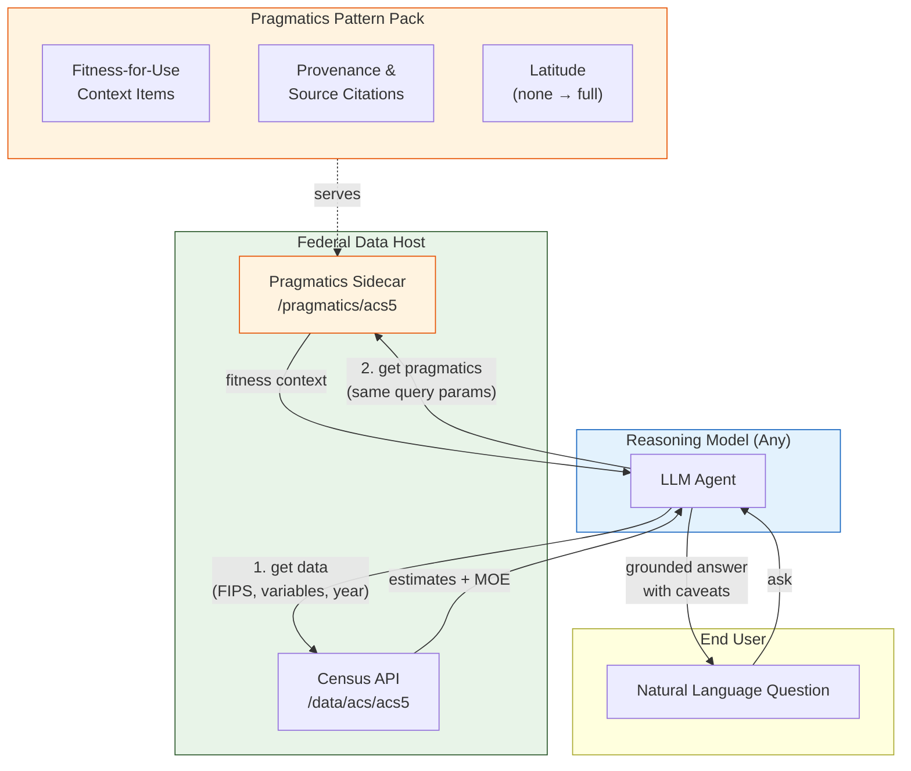

```mermaid
flowchart TB
    subgraph USER["End User"]
        Q["Natural Language Question"]
    end

    subgraph LLM["Reasoning Model (Any)"]
        R["LLM Agent"]
    end

    subgraph HOST["Federal Data Host"]
        API["Census API\n/data/acs/acs5"]
        SIDE["Pragmatics Sidecar\n/pragmatics/acs5"]
    end

    subgraph PPP["Pragmatics Pattern Pack"]
        direction TB
        C1["Fitness-for-Use\nContext Items"]
        C2["Provenance &\nSource Citations"]
        C3["Latitude\n(none → full)"]
    end

    Q -->|"ask"| R
    R -->|"1. get data\n(FIPS, variables, year)"| API
    R -->|"2. get pragmatics\n(same query params)"| SIDE
    API -->|"estimates + MOE"| R
    SIDE -->|"fitness context"| R
    PPP -.->|"serves"| SIDE
    R -->|"grounded answer\nwith caveats"| Q

    style HOST fill:#e8f4e8,stroke:#2d5a2d
    style PPP fill:#fff3e0,stroke:#e65100
    style LLM fill:#e3f2fd,stroke:#1565c0
    style SIDE fill:#fff3e0,stroke:#e65100
```
