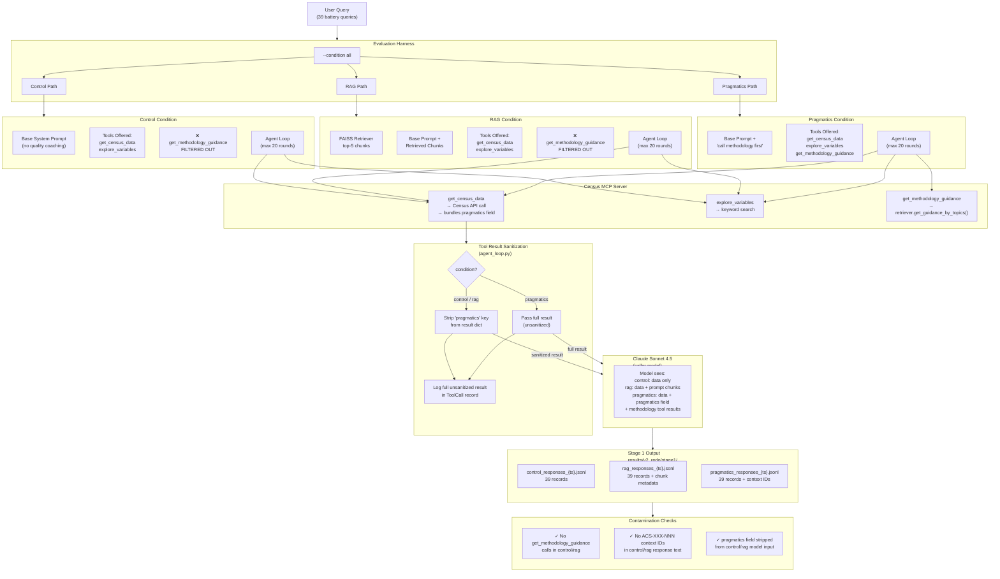

```mermaid
flowchart TD
    Q["User Query\n(39 battery queries)"]

    subgraph HARNESS["Evaluation Harness"]
        direction TB
        H["--condition all"]
        H --> C_PATH["Control Path"]
        H --> R_PATH["RAG Path"]
        H --> P_PATH["Pragmatics Path"]
    end

    Q --> HARNESS

    subgraph CONTROL["Control Condition"]
        direction TB
        C_PROMPT["Base System Prompt\n(no quality coaching)"]
        C_TOOLS["Tools Offered:\nget_census_data\nexplore_variables"]
        C_FILTER["❌ get_methodology_guidance\nFILTERED OUT"]
        C_LOOP["Agent Loop\n(max 20 rounds)"]
    end

    subgraph RAG["RAG Condition"]
        direction TB
        R_RETRIEVE["FAISS Retriever\ntop-5 chunks"]
        R_PROMPT["Base Prompt +\nRetrieved Chunks"]
        R_TOOLS["Tools Offered:\nget_census_data\nexplore_variables"]
        R_FILTER["❌ get_methodology_guidance\nFILTERED OUT"]
        R_LOOP["Agent Loop\n(max 20 rounds)"]
    end

    subgraph PRAG["Pragmatics Condition"]
        direction TB
        P_PROMPT["Base Prompt +\n'call methodology first'"]
        P_TOOLS["Tools Offered:\nget_census_data\nexplore_variables\nget_methodology_guidance"]
        P_LOOP["Agent Loop\n(max 20 rounds)"]
    end

    C_PATH --> CONTROL
    R_PATH --> RAG
    P_PATH --> PRAG

    subgraph MCP["Census MCP Server"]
        direction TB
        GCD["get_census_data\n→ Census API call\n→ bundles pragmatics field"]
        EV["explore_variables\n→ keyword search"]
        GMG["get_methodology_guidance\n→ retriever.get_guidance_by_topics()"]
    end

    C_LOOP --> GCD
    C_LOOP --> EV
    R_LOOP --> GCD
    R_LOOP --> EV
    P_LOOP --> GCD
    P_LOOP --> EV
    P_LOOP --> GMG

    subgraph SANITIZE["Tool Result Sanitization\n(agent_loop.py)"]
        direction TB
        S_CHECK{"condition?"}
        S_STRIP["Strip 'pragmatics' key\nfrom result dict"]
        S_PASS["Pass full result\n(unsanitized)"]
        S_LOG["Log full unsanitized result\nin ToolCall record"]
    end

    GCD --> SANITIZE
    S_CHECK -->|"control / rag"| S_STRIP
    S_CHECK -->|"pragmatics"| S_PASS
    S_STRIP --> S_LOG
    S_PASS --> S_LOG

    subgraph MODEL["Claude Sonnet 4.5\n(caller model)"]
        M_SEES["Model sees:\ncontrol: data only\nrag: data + prompt chunks\npragmatics: data + pragmatics field\n+ methodology tool results"]
    end

    S_STRIP -->|"sanitized result"| MODEL
    S_PASS -->|"full result"| MODEL

    subgraph OUTPUT["Stage 1 Output\nresults/v2_redo/stage1/"]
        direction TB
        O_CTRL["control_responses_{ts}.jsonl\n39 records"]
        O_RAG["rag_responses_{ts}.jsonl\n39 records + chunk metadata"]
        O_PRAG["pragmatics_responses_{ts}.jsonl\n39 records + context IDs"]
    end

    MODEL --> OUTPUT

    subgraph VERIFY["Contamination Checks"]
        direction TB
        V1["✓ No get_methodology_guidance\ncalls in control/rag"]
        V2["✓ No ACS-XXX-NNN context IDs\nin control/rag response text"]
        V3["✓ pragmatics field stripped\nfrom control/rag model input"]
    end

    OUTPUT --> VERIFY
```
